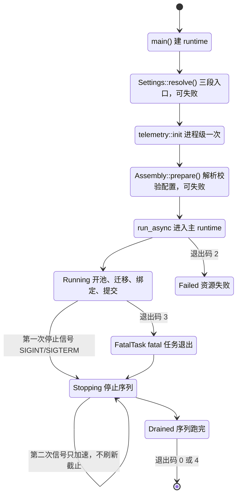
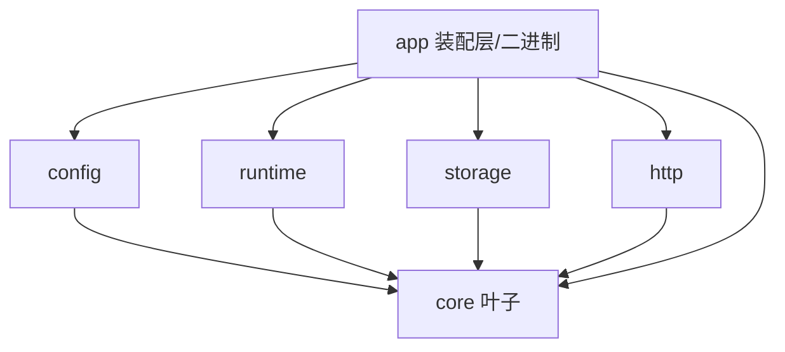
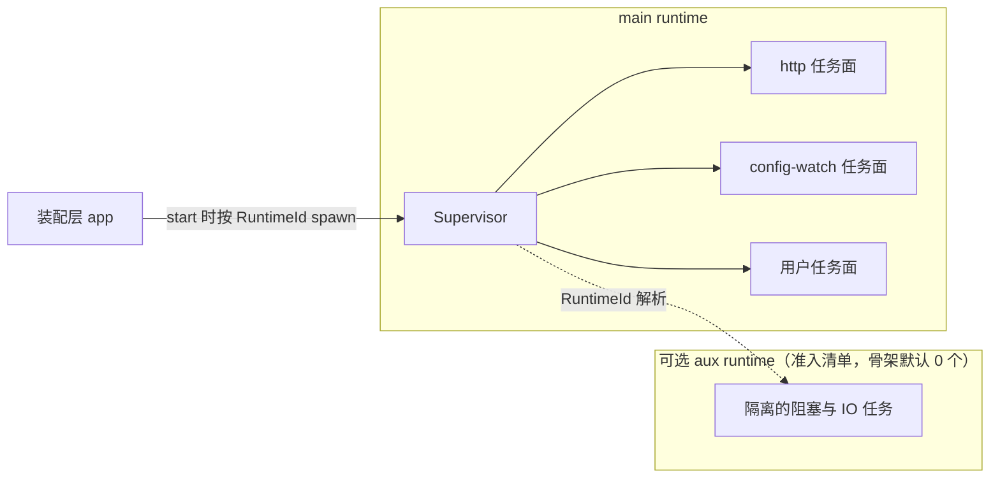
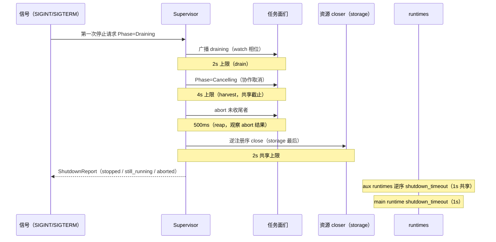

# axum-starter-template 架构设计

> 状态：阶段 0 产出，**闸门 1 待确认**。本文是设计文档；实现与验收证据在阶段 1 / 2 产生。
> 本文所有第三方语义的版本与出处见 `docs/references.md`；本文引用第三方语义处只写版本与出处锚点。

本模板的目标：`cargo generate` 出来的项目开箱就是一个"能起、能停、能测"的 Rust Web 服务骨架，
并且骨架本身把一组难写对的进程纪律写对。模板是一份**起点代码**（复制之后改），不是框架（依赖之后调）。

---

## 1. 目标 / 非目标 / 「第一天」的可验收契约

### 1.1 目标（不变量）

| 编号 | 不变量 | 一句话验收 |
| --- | --- | --- |
| I1 | 单向分层的 workspace | 实际依赖图 == 邻接表，越界/漏登记即红；`core` 是叶子 |
| I2 | 顶层任务面可监督 | 五类退出各有可观测记录；同 key 单化身；不留 detached |
| I3 | 关停可预测、可解释 | 固定序列 + 分层绝对预算；超时/二次信号各有一条测试；不假报 graceful |
| I4 | 三段式配置 + 热重载不骗人 | 路径锚点=可执行文件目录；冷段回滚 + 待重启清单；缺文件落盘内嵌模板 |
| I5 | 生成契约成立 | 一个提示 `crate_prefix`；生成结果 `make check` 三条；两条 README 垂直切片可照抄走通 |

支撑约束：零业务全局态（一个进程可同时跑两套独立装配）、可观测性只在装配层初始化、
取证纪律（第三方语义带版本 + 出处）。

### 1.2 非目标（红线）

- 不是框架：没有 `trait Service`、没有插件系统、没有宏、没有 `AppState` 预置字段。
- 不带业务：生成结果无示例任务面、无 API 端点、不预建表、不预放仓储。
- 不做预铺：不预抽 `middleware/`、不预置无消费者的配置项/依赖/字段。
- 不带部署事实：不写死端口号、交叉编译目标、容器链、glibc 门禁。
- 生成结果不带 CI 配置。

### 1.3 「第一天」的可验收契约

1. **生成**：`cargo generate --git <模板仓库> --name <project-name>`，只回答一个提示 `crate_prefix`；
   生成后用户改 `[workspace.package]` 的 `version` / `authors`。
   - `project-name`（cargo-generate 内建）：目录名 / 仓库名；
   - `crate_name`（内建，snake_case）：二进制名、README 标题；
   - `crate_prefix`（唯一自定义提示）：包名前缀。
   - 三者互相独立；模板不用其中一个顶替另一个。
2. **验证骨架成立**：`make check`（fmt-check / lint / test）全绿；`cargo run` 起进程且第一条日志有构建串；
   `Ctrl-C` 后关停日志里每个任务都有 `stopped`（任务名 + runtime）。
3. **加第一个顶层任务面**：照 README 切片一，把自己写的任务注册进 supervisor；`Ctrl-C` 后能看到它的 `stopped`。
4. **加第一个仓储**：照 README 切片二，迁移 + 仓储实现 + 装配接线一条龙走通。

### 1.4 生命周期总览



---

## 2. 纪律清单（每条：纪律 → 为什么 → 代码落点 → 自动化证据）

| # | 纪律 | 为什么 | 代码里的落点（文件级） | 自动化证据 |
| --- | --- | --- | --- | --- |
| D1 | `core` 无兄弟依赖；兄弟依赖边 == 邻接表 | 分层单向才能局部替换、避免环 | `Cargo.toml`（根 `members` / `[workspace.dependencies]`）+ `crates/app/tests/structure.rs` 里的邻接表常量 | `structure.rs`：`sibling_edges_match_adjacency_table`、`core_is_leaf` |
| D2 | 第三方依赖只在根声明一次，旁注"为什么" | 版本一致性 + 依赖可审计 | 根 `Cargo.toml [workspace.dependencies]`（每条带行内 `# 为什么`）；成员 `{ workspace = true }` | `structure.rs`：`member_deps_are_workspace_inherited`、`workspace_deps_have_reasons_and_are_used` |
| D3 | 窄门面：`lib.rs` 只做 `mod` + `pub use` | 公共面显式，改动有 diff 意义 | 每个 `crates/*/src/lib.rs` | `structure.rs`：`lib_facades_are_narrow` |
| D4 | 任务面返回 future，spawn 目标由装配层给 | 任务面不写死 runtime，测试可换执行器 | `crates/runtime/src/spec.rs`、`crates/app/src/assembly.rs` | `runtime`：`task_spawned_to_aux_runtime_is_harvested` |
| D5 | 五类退出：Completed / Failed / Panicked / Cancelled / Restarted | 关停与失败可解释，不混为一谈 | `crates/runtime/src/exit.rs`、`supervisor.rs` | `runtime/tests/supervisor.rs` 五条 `records_*_exit_*` |
| D6 | 同 key 单化身；重启前先收旧化身 | 双化身=资源双开与重复副作用 | `crates/runtime/src/supervisor.rs` | `restart_waits_for_previous_incarnation_single_identity`、`restart_is_refused_if_previous_incarnation_will_not_stop` |
| D7 | 不留 detached：supervisor 收口所有自己 spawn 的句柄 | 关停可证明 | `crates/runtime/src/supervisor.rs`（JoinSet/映射表） | `tracked_tasks_all_finished_after_shutdown`、`empty_supervisor_stops_cleanly` |
| D8 | 固定关停序列 + 分层绝对预算 | 每一层有上限、内层<外层；二次信号只加速 | `crates/runtime/src/shutdown.rs`（`ShutdownBudget`）、`crates/app/src/bootstrap.rs` | `every_phase_respects_absolute_budget`、`second_stop_request_accelerates_without_extending_deadline` |
| D9 | `stopped` 只给真正收尾的任务；收不回如实上报 | 不假报 graceful | `crates/runtime/src/report.rs`、`crates/app/src/telemetry.rs` | `shutdown_reports_still_running_task_honestly` |
| D10 | 路径锚点=可执行文件目录，永不取 cwd | 换个目录启动不能读到另一份配置 | `crates/config/src/anchor.rs`、`crates/app/src/main.rs` | `anchor_relative_paths_do_not_depend_on_cwd`；模板侧 probe（两个 cwd 跑同一二进制） |
| D11 | 启动与热重载共用一条管线 | 两条管线迟早漂移 | `crates/config/src/pipeline.rs`（唯一 `load_pipeline`） | `config/tests/reload.rs` 全组 |
| D12 | 热度分档：hot 白名单 / semi 白名单 / 其余默认 cold 回滚 | 冷段漏登记不能静默假报已生效 | `crates/config/src/tier.rs`、`reload.rs` | `every_leaf_path_is_explicitly_classified`、`cold_change_is_rolled_back_and_listed_for_restart` |
| D13 | 重载失败保留 last-good，绝不半套用 | 无人值守下不可自伤 | `crates/config/src/reload.rs`（先构造候选再一次性 apply） | `invalid_reload_keeps_last_good_and_reports_error` |
| D14 | 敏感信息 `*_env > *_file > 明文`，Debug 渲染 `***` | 日志/`Debug` 不泄密 | `crates/config/src/secret.rs`、`crates/storage/src/lib.rs` | `secret_precedence_*`、`secret_debug_is_redacted` |
| D15 | 零业务全局态 | 一个进程能跑两套装配 | 无 `static`/`OnceLock`（装配层 `crates/app/src/*` 全部参数注入） | `isolation.rs`：`two_assemblies_run_concurrently_without_interference`、`structure.rs`：`no_global_state_in_crates` |
| D16 | 可观测性只在装配层初始化；日志形态只出一种 | 库不装 subscriber；形态一致 | `crates/app/src/telemetry.rs`（唯一 subscriber）；库只 `use tracing` 发事件或产出结构化记录 | `structure.rs`：`no_subscriber_init_in_libs` |
| D17 | 零配置可起 | 第一天不能卡在配置上 | `crates/config/src/embedded.rs`（内嵌默认模板）+ 缺文件落盘 | `default_config_equals_embedded_template`、`missing_config_file_is_written_from_embedded_template` |
| D18 | 渲染面与生成结果审计 | `ignore` 静默跳过、Liquid 静默清空都会骗人 | `tools/audit/`（模板侧）+ `hooks/post.rhai`（生成期断言） | `make gate` 中的 `audit` / 泄漏扫描；`docs/verification.md` 记录 |
| D19 | `.rs` 与名字的 fmt 关系显式化 | rustfmt 不是名字无关的（见 `docs/references.md`） | 全部 `.rs` 过 Liquid；`hooks/pre.rhai` 校验前缀形状与长度上限 | 模板侧 `make matrix`：含上限长度前缀的生成 + `cargo fmt --check` |

---

## 3. workspace 划分（DP1）

### 3.1 成员与依赖邻接表



| crate | 目录 | 骨架内容（做什么 / 不做什么） | 允许的兄弟依赖 |
| --- | --- | --- | --- |
| `{{crate_prefix}}-core` | `crates/core` | 错误分类与 `Result` 别名；**不依赖任何兄弟** | — |
| `{{crate_prefix}}-config` | `crates/config` | 配置 schema / 三段入口 / 路径锚点 / 管线 / 热度分档 / 重载事务 / `Secret`；不建任务、不装 subscriber、不依赖 tokio | `core` |
| `{{crate_prefix}}-runtime` | `crates/runtime` | supervisor / 任务面契约 / 五类退出 / 关停预算与报告 / `RuntimeId`；不装 subscriber、不拥有 runtime | `core` |
| `{{crate_prefix}}-storage` | `crates/storage` | `Db` 门面（开池 / 关池）+ 迁移运行器 + `migrations/`（**空**，只有说明文件）；不含任何仓储、不建表 | `core` |
| `{{crate_prefix}}-http` | `crates/http` | `router()`（零路由）+ `serve(listener, router, shutdown)` 任务面；不含业务端点。`shutdown` 是 `impl Future<Output = ()>`，因此 http 不依赖 runtime（取消原语的类型留在 runtime/app） | `core` |
| `{{crate_prefix}}-app` | `crates/app` | 装配层：settings / 装配 / telemetry / 信号 / 关停编排 / 退出码；`lib.rs` + `main.rs`（薄） | `core`,`config`,`runtime`,`storage`,`http` |

**禁止的边**（越界即红）：任何 `X → app`；`core → 任何兄弟`；`config ↔ runtime`；`storage ↔ http`；
`config/storage/http/runtime` 之间的横向边；以及用 `[dev-dependencies]` / `[build-dependencies]`
绕过的兄弟边（结构测试对三种依赖表都查）。

### 3.2 邻接表如何被机械校验

`crates/app/tests/structure.rs` 内用 `toml` 解析全部成员 `Cargo.toml`：

1. 取本 crate 名（`CARGO_PKG_NAME` = `{{crate_prefix}}-app`），剥出前缀，构造期望的六元组；
2. 对每个成员：兄弟依赖键集合（三种依赖表合并）必须**恰好等于**邻接表给出的集合（多一条、少一条都红）；
3. 每个兄弟依赖必须 `workspace = true`；非兄弟依赖也必须是 `workspace = true`（第三方只在根声明一次）；
4. 根 `[workspace.dependencies]` 的每条：必须被至少一个成员使用，且依赖行有行内 `#` 理由注释；
5. `core` 的兄弟集合为空。

门面检查（同一测试文件，规则是行级白名单）：`crates/*/src/lib.rs` 只允许
`//!` 文档、`#![...]` 属性、`mod NAME;`、`pub use ...;`、空行；`pub mod`、`pub use x::*`、
其它语句一律红——唯一例外机制是"同行的 `// 例外: <理由>` 注释"，且 `tools/audit` 会把这些
例外行汇总进 `make audit` 输出（有理由的例外必须能被一眼看到）。生成结果里没有例外，因此
这条规则在骨架上是零容忍。

### 3.3 `storage` / 切片支撑：与「不预建表、不做预铺」的张力裁决

- 保留 `storage` 成员并**预接线**（装配层开池 + 迁移 + 最后关闭），因为它有真实消费者：
  启动时打开数据库、应用迁移（空迁移集）、关停时最后关闭。这不是"以后可能会用"，而是骨架每天在跑的东西。
- **不**预建表、**不**预放仓储：`crates/storage/migrations/` 只有 `README.md`（说明迁移命名/纪律），
  没有任何 `.sql`；`lib.rs` 只导出 `Db` 与 `migrate`。
- 切片一（加任务面）只需要三处改动：新建 `crates/app/src/flush.rs`（用户任务面）+
  `crates/app/src/lib.rs` 加一行 `mod flush;` + `crates/app/src/assembly.rs` 加一行注册；
  切片二（加仓储）需要三处：新增 `crates/storage/migrations/0001_*.sql`、新增
  `crates/storage/src/notes.rs`（仓储实现，`lib.rs` 一行 `pub use`）、`assembly.rs` 接线并交给一个任务面消费。
  两切片都不新增 crate、不改邻接表——这是"砍到这一层仍能照抄走通"的判据。

### 3.4 两条 README 垂直切片的具体形状（README 契约）

| 切片 | README 步骤 | 代码块来源（模板侧，运行时注入生成项目） |
| --- | --- | --- |
| 一、加第一个顶层任务面 | ① 新建任务面文件（`ctx.cancelled()` 协作收尾，返回 `Result<(), Error>`）；② `lib.rs` 声明模块；③ `assembly.rs` `register(TaskSpec::new(...))`；④ `make check`；⑤ `cargo run` + Ctrl-C 看到 `stopped` | `scripts/slices/task/*.rs` + 注册片段 |
| 二、加一个仓储 | ① 加迁移 SQL；② 写仓储（拿到 `Db` 门面，用 `sqlx::query`）；③ `lib.rs` 导出；④ `assembly.rs` 接线并把仓储交给任务面消费；⑤ `make check` + 运行看迁移生效 | `scripts/slices/repo/*` |

- README 代码块里写的是 Liquid 占位符（用户看到自己项目的前缀）；模板侧 `scripts/slices/` 是"答案文件"，
  用验证用的固定名字（如 `--name slice-check --define crate_prefix=svc`）。
- 反漂移：`tools/audit` 把 README 模板用同一组验证名渲染后，逐个代码块与 `scripts/slices/` 文件比对，
  不一致即红（README 与可执行证据不能各说各话）。

### 3.5 每 crate 的 README

每个成员目录带 `README.md`：边界（允许/禁止的依赖）、目录说明、关键决策、测试形态。
模板侧与生成结果共用同一份（同一文件，两侧一致）。

---

## 4. runtime 与任务面（DP2 / DP3 / DP4）

### 4.1 拓扑



- 任务面契约：`Fn(TaskContext) -> TaskFuture`，`TaskFuture = Pin<Box<dyn Future<Output = Result<(), Error>> + Send>>`。
  任务面**不写 spawn**；spawn 目标由装配层注册时的 `RuntimeId` 决定。
- `RuntimeId`：`RuntimeId::MAIN` 常量 + 命名附加 runtime `RuntimeId::new("io")`。
- `RuntimeSet`（runtime crate 提供）把 id 映射到 `tokio::runtime::Handle`；解析未注册的名字 =
  **启动错误**（`start()` 返回 `UnknownRuntime`），不回落。理由：静默回落会把"任务在哪个 runtime"
  这个事实变成猜测；错误在启动期暴露成本最低。
- 多 runtime 准入清单（写进 `crates/runtime/README.md`）：只有当任务需要隔离调度（阻塞/CPU 密集/
  低延迟 IO）且能说明"为什么主 runtime 不合适"时才加；aux runtime 的 IO 资源仍在主 runtime 建，
  关闭顺序永远 aux 先、main 后。

### 4.2 五类退出与观察通道

```rust
pub enum ExitCause {
    Completed,   // 自行正常返回，且无人要求它停
    Failed,      // 自行返回错误，且无人要求它停
    Panicked,    // panic（unwind 被 JoinError 捕获）
    Cancelled,   // supervisor 因关停要求它停（含 abort 收尾）
    Restarted,   // supervisor 因重启替换要求它停
}
pub struct ExitRecord {
    pub key: TaskKey,
    pub runtime: RuntimeId,
    pub incarnation: u64,        // 同 key 递增，用于证明"上一化身"
    pub cause: ExitCause,
    pub outcome: TaskOutcome,    // Returned / Failed / Panicked / Aborted（future 的结局）
    pub uptime: Duration,
    pub detail: Option<String>,
}
```

**分类口径（决策，见 §12「五类退出的分类口径」行）**：`cause` 记录"这次退出是谁的意图"，`outcome` 记录 future 的结局。
supervisor 主动要求停 → `Cancelled` / `Restarted`（即便任务优雅返回 Ok，outcome 记 `Returned`）；
任务自行结束 → `Completed` / `Failed` / `Panicked`。五类互斥、各有 `ExitRecord`。

- 观察通道：`Supervisor::subscribe() -> broadcast::Receiver<ExitRecord>`。
  库不依赖 tracing；把记录变成日志是装配层的唯一职责（`crates/app/src/telemetry.rs`）。
  测试直接订阅通道断言，不装全局 subscriber。
- `TaskOutcome` 另有一条派生断言：`Panicked` 需要 `panic = "unwind"`（DP4，选择 unwind）。

### 4.3 重启语义（DP3）

| 策略 | 含义 |
| --- | --- |
| `RestartPolicy::Never`（默认） | 退出是终态，不重启 |
| `RestartPolicy::Restart { max, backoff, backoff_cap }` | 连续失败/panic 后重启；指数退避、封顶；连续稳定运行 ≥ `stability`（60s，常量）后计数清零；`max` 次耗尽 → 终态 |

- `fatal: bool`（默认 `true`）：任务在**非关停期**自行退出（Ok/Err/panic 任一），或重启预算耗尽，
  且 `fatal` 为真 → supervisor 请求**优雅关停**，进程退出码 3（不是 abort、不是 panic 传播）。
- 关停期边界：一旦进入 Stopping，任何退出都不触发重启；`Restarted` 只可能发生在 Running 期。
- 重启入口：`SupervisorHandle::restart(key)`（异步）。因为 I2 要求 `Restarted` 这一类必须有触发点，
  而"策略重启"发生在旧化身已自行退出之后，无法把旧化身归为 `Restarted`。该 API 由测试覆盖，
  并在 runtime README 给出用法（配置冷段变更后需要重启任务时使用）。

### 4.4 panic 策略（DP4）

`[profile.release] panic = "unwind"`（显式写出，附注释：abort 会绕过 supervisor 对 panic 的观察，
也绕过 HTTP 层的 panic 捕获，与 I2 的五类退出不自洽）。调试/发布一致，不改 `debug-assertions` 等。

装配层安装 panic hook（`std::panic::set_hook`），把 panic 位置与线程名交给 tracing；
分类仍由 `JoinError::is_panic` 完成（hook 只做日志，不改行为）。

---

## 5. 进程生命周期（DP5 / DP6）

### 5.1 启动协议

| 阶段 | 位置 | 可失败？ | 边界 |
| --- | --- | --- | --- |
| `Settings::resolve()` | `crates/app/src/settings.rs`（sync） | 是（退出码 2） | 路径锚点、三段入口取配置文件位置、加载/校验配置。**不含任何 IO 资源** |
| `telemetry::init()` | `crates/app/src/telemetry.rs`（sync，进程级一次） | 是（回退到 stderr 后用默认 filter） | 之后所有失败都有结构化日志；首条事件=构建串 |
| `Assembly::prepare()` | `crates/app/src/assembly.rs`（sync） | 是（退出码 2） | 由 config 构造各 crate 的纯参数（地址、路径、策略）；**不监听、不开池** |
| `Assembly::register()` | 同上（sync，可多次） | 是（退出码 2）：重复 key | 注册任务面与资源 closer 的唯一入口；装配层与测试都用它（README 切片一用的也是这一行） |
| `run_async()` 前半段 | 主 runtime 内 | 是（退出码 2） | 开池 → 迁移 → `TcpListener::bind` → 构造 `Supervisor`、注册任务与资源 closer |
| `supervisor.start()` | 主 runtime 内 | 是（退出码 2）：重复 key / 未注册 runtime | **提交点**：此前一切是准备，此后任务开始运行 |

- CLI 只有一个参数 `--config <path>`（`clap` 派生，理由见 `docs/references.md` 依赖表）；
  三段入口的优先级与路径锚点规则见 §6.1。
- 没有 readiness barrier：不要求任务面"确认就绪"，因此也没有"缺确认的上限"这一说的超时；
  替代品是"准备期失败即拒启动"（开池/迁移/绑定都在提交点之前，各自带自己的上限：
  SQLite `busy_timeout`、绑定是同步系统调用）。
  代价：任务在 start 之后才发现的配置问题只能通过退出记录暴露（不假装成启动失败）。
- 首个日志事件固定为构建串（`name version git=<sha|unknown> dirty=<0|1> profile`），来源
  `crates/app/build.rs`（编译期注入 `BUILD_GIT_SHA` / `BUILD_GIT_DIRTY`，git 不可用则 `unknown`）。

### 5.2 关停序列与分层绝对预算



| 层 | 阶段 | 绝对上限 | 二次信号后 |
| --- | --- | --- | --- |
| L0 | 装配层看门狗（超时则打印报告后强制退出，退出码 4） | 15s | 不刷新 |
| L1 | supervisor 关停总预算（每个阶段取 `min(阶段预算, 剩余)`） | 12s | 不刷新 |
| L2a | drain（广播 → cancel） | 2s | 0（直接 cancel） |
| L2b | harvest（cancel → abort） | 4s | 250ms |
| L2c | reap（abort 后观察） | 500ms | 250ms |
| L2d | resources（LIFO，共享截止） | 2s | 250ms |
| L2e | aux runtimes（逆序，共享截止） | 1s | 250ms |
| L2f | main runtime `shutdown_timeout` | 1s | 1s（同步段，不可加速） |

- L2 合计 10.5s < L1 12s < L0 15s；每层相对外层至少留 1.5s / 3s 余量。
- 第二次停止请求：`StopSignal::force()` 只把已剥离阶段的等待压缩到 `forced_phase_budget = 250ms`，
  **不重置** L1/L0 的绝对截止（内部以 `started_at + total_budget` 记账）。
- 预算类型 `ShutdownBudget` 是注入项（测试用短预算 + `tokio::time` 暂停时钟钉住每段上限），
  默认值是常量，不做成配置项（避免"截止时间来源"多于一个）。
- 诚实上报：`ShutdownReport { trigger, stopped, still_running, aborted, resources_closed, resource_failures, forced, elapsed }`。
  `stopped` 只在预算内真正收尾的任务；超时者进 `still_running`，abort 后仍未结束者留在 `still_running`
  并在 `aborted` 里标注（日志形态：`task did not stop ... action=aborted`）。
  报告另带 `trigger: Signal | TaskFailure`（fatal 任务退出触发的关停与人类信号触发的关停要能区分，
  对应退出码 0/4 与 3）。

### 5.3 退出码

| 码 | 语义 |
| --- | --- |
| 0 | 干净关停：所有任务 `stopped`、资源关闭、未被强推 |
| 2 | 启动失败：配置/校验/开池/迁移/绑定/注册错误 |
| 3 | fatal 任务自行退出或重启预算耗尽 |
| 4 | 关停未完成：二次信号强推、仍有 `still_running`、资源关闭超时 |

### 5.4 空 supervisor

零任务注册时：`start()` 立即进入等待停止；收到信号后报告为空、退出码 0。这条路径有测试
（`empty_supervisor_stops_cleanly`），保证 supervisor 不依赖"至少一个任务"。

---

## 6. 配置与热重载（DP7）

### 6.1 三段入口与路径锚点

| 优先级 | 入口 | 说明 |
| --- | --- | --- |
| 1 | CLI `--config <path>` | 只覆盖"配置文件的位置"；相对路径按 CLI 惯例相对 cwd 解释 |
| 2 | 环境变量 `{{env_prefix}}_CONFIG` | 同上 |
| 3 | `<路径锚点>/config.toml` | 默认入口：**路径锚点 = 可执行文件所在目录**（`std::env::current_exe()` 的父目录），永不取 cwd |

- 配置里的相对路径（含 SQLite URL 里的相对路径、`url_file`）一律从**同一个锚点**派生，
  不以"配置文件所在目录"为基准（配置文件位置可被 CLI/env 改，锚点不能）。
- 缺文件：把内嵌默认模板写到解析出的位置（父目录自动创建）；写不进去（只读锚点）→ 警告并继续用
  内存中的默认值（不拒绝启动）。`cargo run` 下锚点是 `target/debug`，因此生成的默认配置落在
  `target/debug/config.toml`（已被 `/target` 忽略）。

### 6.2 唯一管线


启动与热重载调用**同一个** `pipeline::load_candidate(...)`；重载额外做 diff/apply/报告。
没有任何"启动用一套、reload 用另一套"的分支（防止漂移的机械保证：只有这一个函数读文件）。

### 6.3 配置 schema 与热度分档

| 段 | 键 | 默认 | 档位 | 生效方式 |
| --- | --- | --- | --- | --- |
| `log` | `filter` | `"info"` | 可热 | tracing reload handle，立即生效 |
| `supervisor` | `restart_backoff_ms` | `500` | 半热 | supervisor 下次调度重启时读取（`Arc<RwLock<Backoff>>`） |
| `supervisor` | `restart_backoff_cap_ms` | `30000` | 半热 | 同上 |
| `http` | `bind` | `"127.0.0.1:0"` | 不可热 | 需要重新绑定 → 回滚 + 待重启 |
| `storage` | `url` / `url_env` / `url_file` | `"sqlite:data/service.db?mode=rwc"` / 空 / 空 | 不可热 | 连接目标变化 → 回滚 + 待重启 |
| `storage` | `busy_timeout_ms` | `5000` | 不可热 | 池创建参数 → 回滚 + 待重启 |

- 部署事实（端口等）不进模板代码；端口默认 `127.0.0.1:0`（由 OS 分配），绑定成功后把实际
  `local_addr()` 记进日志。

### 6.4 「冷段漏登记会红」的机制（不是按面登记）

1. `tier::classify(path)` 用**叶子路径**判定：`HOT_PATHS` / `SEMI_PATHS` 是显式白名单，
   其余路径必须匹配 `COLD_PREFIXES`（显式列出的段前缀）；三者都不匹配 → `Tier::Unknown`。
2. 生成侧测试 `every_leaf_path_is_explicitly_classified`：用 serde 把内嵌默认模板展开成叶子路径集合，
   逐个断言 `classify != Unknown`。**新增配置字段如果没人登记 → 测试红**。
3. 运行期防御：遇到 `Unknown` 一律按 cold 处理（回滚 + 记入待重启清单）并打 error 级事件——
   方向安全，绝不"假报已生效"。
4. 落点：`crates/config/src/tier.rs`（分类）+ `crates/config/src/reload.rs`（构造有效配置与报告）。
   三个档位的**副作用由装配层统一执行**（config 完全不依赖 tokio/tracing/runtime，是纯函数库）：
   - hot：`telemetry::apply_log_filter(&effective)`（tracing reload handle，启动与重载走同一函数）；
   - semi：`supervisor.set_restart_backoff(effective.supervisor...)`（写入共享句柄，下次调度重启时读取）；
   - cold：不执行，只打日志列出 `restart_required`。

### 6.5 重载事务与"watch == 生效"

- `reload()` 先构造完整候选（§6.2 全管线），任何一步失败 → 返回 `ReloadError`，生效配置不变（last-good）。
- 成功后：`effective = Config { hot: candidate.hot, semi: candidate.semi, cold: running.cold }`，
  由装配层的 `ConfigState::publish(effective)` **唯一写入口**发布到 `tokio::sync::watch`
  （`crates/app/src/config_state.rs`）：先执行 §6.4 的三个副作用，再 `watch::Sender::send`。
  启动（初始发布）与重载走同一个 `publish`，所以"watch 里的配置 == 生效中的配置"成立；
  测试 `watch_view_equals_effective_config` 在每次重载后逐个字段比对。
- `ReloadReport { applied: Vec<Path>, next_use: Vec<Path>, restart_required: Vec<Path>, error: Option<...> }`
  由序列化树 diff 生成；装配层的 config-watch 任务把它打成一条日志事件（含路径列表）。
- 监听：`notify` 监视配置文件**所在目录**（避免编辑器原子写漏事件），250ms 去抖；
  config crate 以回调形式暴露（不拥有 runtime），装配层把回调桥进 `tokio::sync::mpsc`，
  由 `config-watch` 任务消费。配置读取是同步小文件 IO，放在任务里同步读（README 说明为什么可接受）。

### 6.6 敏感信息

- 字段形状：`url` + `url_env`（环境变量名）+ `url_file`（文件路径，从锚点派生）。
  优先级 `url_env > url_file > url`；多层同时存在 → 高优先级生效 + warn（日志不含取值本身）。
- 校验：`url_env` 指向的变量缺失/为空、`url_file` 不存在/不可读 → 启动错误（退出码 2）。
- 解析结果类型 `Secret<String>`：手写 `Debug` 渲染为 `***`；`expose()` 显式取值。
  tracing 事件里只允许出现 `Secret`（或脱敏后的字符串），`structure.rs` 之外另有一条测试
  `secret_debug_is_redacted` 钉住。

### 6.7 校验与钳位

- 拦截（退出码 2）：`http.bind` 解析失败；`storage.url_env`/`url_file` 解析失败；
  `log.filter` 非法（`EnvFilter` 构造失败）；`supervisor.restart_backoff_ms == 0`。
- 钳位 + warn：`busy_timeout_ms` 落在 `[100, 300_000]` 之外；`restart_backoff_cap_ms` 小于
  `restart_backoff_ms`（提升到等于）；`log.filter` 里未知 target 的 directive 不拦（合法的宽松写法）。
- 判据：只拦"继续跑必然失败"；其余钳到保守值继续跑（无人值守下拒绝启动的代价更大）。

---

## 7. HTTP 面（DP9）

- 范围：**零路由**（`axum::Router::new()`）。不加 `/healthz` / `/ready`：就绪语义需要一个
  "就绪来源"，而骨架里没有任何消费者（没有编排器、没有依赖探针），预置就是预铺。
  用户加第一条路由时自然会把健康检查加上（HTTP crate README 给出一句提示）。
- 端口来源：`[http].bind`（默认 `127.0.0.1:0`，由 OS 分配）。绑定在提交点之前完成，
  成功后 `info!` 打印 `local_addr()`（这样零端口默认也能被 curl）。
- 任务面形态：`http::serve(listener, router, shutdown) -> Result<(), Error>`，其中 `shutdown`
  是 `impl Future<Output = ()> + Send`（装配层传 `ctx.cancelled()`），因此 http crate 不需要依赖 runtime；
  内部 `axum::serve(...).with_graceful_shutdown(shutdown)`（await 连接收尾）。
- 关停：draining 阶段停止接收新连接由 axum 的 graceful shutdown 完成；预算走 supervisor 的 harvest。

---

## 8. 存储面（DP1 / DP9）

- 门面：`Db`（`SqlitePool` 的 newtype 门面，`open(config) -> Result<Db>` / `close(self) -> Result<()>` /
  `pool(&self) -> &SqlitePool`）；`migrate(&Db)` 运行 `sqlx::migrate!("./migrations")`（**空迁移集**，
  只有 `migrations/README.md` 说明纪律）。
- 编译闭包：`sqlx` 只开 `["sqlite", "runtime-tokio", "migrate", "macros"]`（sqlite 走 bundled，
  不需要系统 SQLite / 任何非 Rust 工具链）。
- 关闭所有者：装配层是唯一所有者；把 `Db::close` 注册为 supervisor 的**最后一个** closer（LIFO），
  预算 2s，超时进 `resource_failures`（不假报关闭成功）。
- 迁移纪律（写进 `crates/storage/README.md` 与迁移目录 README）：文件名 `NNNN_描述.sql`；
  只前滚、不改已合并的迁移；迁移在启动提交点前运行，失败即拒启动（退出码 2）。
- 引擎选择：SQLite（默认 `sqlite:data/service.db?mode=rwc`，相对路径从锚点派生）。
  理由：单人第一天零外部依赖就能起；异步池 + 迁移由 sqlx 提供，接缝清楚。
  代价：换成 Postgres 需要改 `storage` 的引擎类型与 URL（README 记录步骤，不在骨架里提供双后端抽象）。
- URL 纪律：只支持 `sqlite:` 一个 scheme（其余 scheme 在 `Db::open` 明确报错，不做"看起来支持"的抽象）；
  `sqlite:` 后为相对路径时由 config 的路径解析步骤改写成 `<锚点>/…`；`sqlite::memory:` 原样透传。
  `mode=rwc` 依赖 sqlx 对 SQLite URL 查询参数的支持（`docs/references.md`），阶段 1 用
  `pool_opens_and_migrations_apply` 钉住；若该参数不被支持，退化为在 `Db::open` 里设置
  `create_if_missing(true)`（把默认 URL 里的 `?mode=rwc` 去掉），对外行为不变。

---

## 9. 生成面（DP8）

### 9.1 占位符与派生

| 占位符 | 来源 | 用途 | 形状约束 |
| --- | --- | --- | --- |
| `{{project-name}}` | cargo-generate 内建 | 目录名 / 仓库名 | 由用户 `--name` 决定 |
| `{{crate_name}}` | cargo-generate 内建（snake_case） | 二进制名、README 标题 | pre hook 要求 `^[a-z_][a-z0-9_]*$` |
| `{{crate_prefix}}` | **唯一提示** | 包名前缀（`svc-core`） | 见 §9.3 |
| `{{crate_prefix_snake}}` | pre hook 派生（`to_snake_case`） | Rust 路径（`use svc_core::...`） | 随前缀 |
| `{{env_prefix}}` | pre hook 派生（`crate_name.to_shouty_snake_case()`） | 环境变量前缀 | 见 §6.1 |

**不给 `crate_prefix` 默认值**（决策见 §12「`crate_prefix` 是否给默认值」行）：默认值会让"没想清楚就回车"产出
一个用户没意识到的前缀，而前缀会进包名、环境变量与代码路径；`--silent` 场景用
`--define crate_prefix=...` 或 `--values-file` 显式提供。

### 9.2 渲染面

- **默认全渲染**：不写 `include`/`exclude`。所有会进生成结果的文件都该过 Liquid；
  需要"模板侧与生成侧同名但内容不同"的文件用 `.liquid` 后缀机制：
  - 模板侧：`Makefile`、`README.md`、`.gitignore`（模板仓库自己的工程/文档/忽略表）；
  - 生成侧：`Makefile.liquid`、`README.md.liquid`、`.gitignore.liquid`（渲染后去掉后缀，
    并且**遮蔽**同名模板侧文件）。
  机制与顺序已在 0.24.0 上实测（见 `docs/references.md`）。
- **`.rs` 全部过 Liquid**（选择 A，决策见 §12「`.rs` 渲染策略与 fmt 封堵」行）：代码里写 `{{crate_prefix_snake}}_core::...`，
  生成结果里是用户自己的包名。代价是 rustfmt 的名字相关性（见下），用两道闸门处理：
  1. `hooks/pre.rhai` 校验前缀形状 + 长度上限（32），并校验 `crate_name` 形状；
  2. 模板侧 `make matrix` 用**上限长度前缀** + 一组名字生成并跑 `cargo fmt --check`；
     模板代码避免把名字放进会因宽度换行的构造（多条目 `use a::{b, c}` 一律写成一条一行）。
- Rust 的 `{{` 转义花括号：模板侧 audit 扫描所有渲染面文件的 `{{`/`{%`/`{#`，未匹配到已知占位符名即红；
  生成阶段 Liquid 解析失败会**直接失败**（0.24.0 实测），不是静默放过。
- `ignore`（字面路径，`0.24.0` 不支持通配符、不存在时静默跳过）只列模板内部材料：
  `["docs", "scripts", "tools"]`。**不能**把 `hooks`、`Makefile`、`Makefile.liquid`、`README.md`、
  `README.md.liquid`、`.gitignore`、`.gitignore.liquid` 写进 `ignore`：`hooks` 会让 post hook 轮不到执行，
  其余名字会在 `.liquid` 去后缀之后误删生成侧文件（顺序：拷入临时目录并去 `.liquid` 后缀 → pre hook →
  按 `ignore` 删 → 渲染 → post hook）。audit 对每条 `ignore` 断言"模板树里真实存在"（防手误静默跳过）。
- audit 的顶层白名单（模板树根只允许）：`Cargo.toml`、`cargo-generate.toml`、`Makefile`、`Makefile.liquid`、
  `README.md`、`README.md.liquid`、`.gitignore`、`.gitignore.liquid`、`crates/`、`hooks/`、`docs/`、
  `scripts/`、`tools/`、`.git/`；并递归扫描生成面目录（`crates/`、`hooks/`、根文件）里的残留物
  （`.DS_Store`、`*.swp`、`*.orig`、`target/`、`*.db`），出现即红。

### 9.3 `hooks/pre.rhai` 与 `hooks/post.rhai` 职责

| hook | 职责 |
| --- | --- |
| `pre` | 派生 `crate_prefix_snake` / `env_prefix`；校验 `crate_prefix`（正则形状、长度 ≤32、不以分隔符结尾、无连续分隔符）与 `crate_name`；不满足 → `abort("...")`，消息给出正确示例 |
| `post` | **文件级**生成期断言与收尾（rhai `file` 模块没有读内容 API，内容级审计归模板侧 `tools/audit`）：模板侧材料（`docs/`、`scripts/`、`tools/`、模板侧根文件）不在结果里；没有 `.liquid` 残留；收走 `hooks/` 空目录 |

内容级审计（残留 `{{`、空占位符值、里程碑/阶段词、模板门禁目标名）由模板侧 `tools/audit` 对**生成结果**做（`make check-gen` / `make probe` 的一部分），也在生成前的模板树审计里做一次（防患于未然）。

- 前缀形状（写进提示与 pre hook）：`^[a-z][a-z0-9]*([_-][a-z0-9]+)*$`，长度 1–32。
  cargo 拒绝数字开头的包名（实测），所以首字符必须是字母；`svc-core` / `svc_x` 这类包名 cargo 原样接受（实测）。
- 不需要撞名黑名单：**不发布 `Cargo.lock`、门禁不带 `--locked`**（决策见 §12「锁文件政策」行）。
  实测：成员包名与依赖图里已有包同名（如 `axum-core`）时 cargo 会在锁文件里用"名字+版本"消歧并正常解析，
  只有"发布的锁 + `--locked`"才会让用户第一条命令红在无关位置。

### 9.4 两侧门禁分工

| 侧 | 入口 | 内容 |
| --- | --- | --- |
| 生成结果 | `make check` | `fmt-check`（`cargo fmt --all -- --check`）、`lint`（`cargo clippy --workspace --all-targets -- -D warnings`）、`test`（`cargo test --workspace`）。**门禁的唯一定义**；不需要任何非 Rust 工具链（make + cargo 之外） |
| 模板仓库 | `make gate` | `audit`（模板树审计 + 渲染面/泄漏审计）→ `matrix`（名字/前缀矩阵生成 + fmt/元数据检查）→ `check-gen`（极端长名 + 极端短名各一次完整 `make check`，生成目录在仓库树外、各用自己的 target）→ `probe`（真实进程启停）→ `slices`（两条 README 切片照抄走通） |

模板仓库自己的门禁工具：`tools/audit`（**独立 workspace 的 Rust crate**，在 `ignore` 列表里，不进生成结果），
内容审计用 Rust 写（确定性、跨平台、无 grep 依赖）；进程探针用 bash 驱动（要发 SIGINT、看退出码），
两者都由模板侧 `Makefile` 调用。

---

## 10. 测试策略（DP10）

### 10.1 不变量 → 证据形态

| 证据形态 | 覆盖 | 位置 |
| --- | --- | --- |
| 结构测试（解析 `Cargo.toml` 与 `src/*.rs` 文本） | I1、支撑约束（零全局态、窄门面、依赖理由） | `crates/app/tests/structure.rs` |
| 行为测试（in-process，`tokio::time` 暂停时钟） | I2、I3、I4 | `crates/runtime/tests/*`、`crates/config/tests/*`、`crates/storage/tests/db.rs`、`crates/app/tests/config_state.rs`（watch==生效、副作用应用） |
| 进程探针（真实二进制 + SIGINT + 日志/退出码断言 + 两个 cwd 对照 + 配置落在锚点） | I3、I5、DoD 3/8 | 模板侧 `scripts/probe.sh`（由 `make probe` 调用） |
| 生成矩阵（cargo-generate 真实展开，仓库树外，不复用编译缓存） | I5、DoD 2 | 模板侧 `make matrix` / `make check-gen` |
| 切片走通（照 README 代码块应用 + `make check` + 运行断言） | I5、DoD 4 | 模板侧 `scripts/slices/` + `make slices` |
| 渲染面/泄漏审计 | I5、DoD 5 | `tools/audit` + `hooks/post.rhai` |
| 跨工具链编译（`cargo +1.91 check/test`，本机可用 toolchain） | MSRV 说明的可信度 | 模板侧 `make check-gen` 的附加步骤（可选） |

### 10.2 已知限制（不藏）

- 结构测试是文本/清单级检查：它证明"登记的边 == 实际的边"，不证明运行期没有动态耦合（Rust 里后者不存在）。
- `no_global_state_in_crates` 是源码文本扫描，只覆盖本仓库 crate 的 `src/`；用户新加的文件同样被扫到。
- `rust-version = "1.85"`（edition 2024 的下限）只是标注：本机只在 1.95 上做过完整验证，
  1.91 只承诺 `check` 级别（若执行），不为 1.85 背书。
- 进程探针只在 macOS arm64（本机）跑过；Linux/Windows 未验证（`docs/verification.md` 会如实写）。
  具体一点：`--path` 模板的 `.liquid` 遮蔽走的是 `copy.rs` 的"存在 `.liquid` 则跳过无后缀文件"逻辑（平台无关），
  而 `--git` 模板走 `fs::rename` 覆盖（依赖平台的替换语义）；即使某平台行为不同，模板侧 audit 的泄漏扫描会红，
  不会静默泄漏。
- `panic = "unwind"` 能观察任务 panic，但阻塞任务或 runtime worker 线程上的 panic 仍会终止进程（tokio 语义），
  骨架不承诺兜住这一类。
- 预算测试用暂停时钟钉住"每段不超过上限"；真实墙钟下的收尾质量由 probe 记录（不宣称毫秒级保证）。

### 10.3 测试布局

- 单元测试贴在源文件（配置钳位、退出码映射等纯函数）；
- 集成测试放 `tests/`（supervisor、reload、isolation、structure）；
- 不装全局 subscriber；需要观察 supervisor 行为时订阅 `ExitRecord` 通道；
- dev-dependencies：`tokio{test-util}`、`tempfile`、`toml`（结构测试解析）——都有明确消费者。

---

## 11. 决策记录（DP1–DP10）

### DP1 crate 集合与依赖邻接表

- **方案 A**：六成员（core/config/runtime/storage/http/app），`storage` 预接线（空迁移），
  表见 §3.1。**方案 B**：去掉 `storage`（切片二里新增 crate）/ 去掉 `http`（零路由时没意义）。
- 代价：A 让骨架多一个必须打开的 SQLite 文件，以及 sqlx bundled SQLite 带来的首次编译时间
  （具体数字在 `docs/verification.md` 里回填，不预写结论）；B 则让"加仓储"的切片
  变成"先建 crate 与接线"，且 I1 的邻接表在骨架里少一条真实边（少了可被测试的样例）。
- **选择 A**。判据：I5 要求两条切片"照抄走通"，其中"加仓储"必须有迁移运行器与关闭所有者才有意义；
  且 `storage` 的关闭顺序（最后关）是 I3 序列里唯一有真实消费者的资源。
- `testkit` 不做成员：骨架期没有第二个消费者（两套装配测试写在 `app/tests/isolation.rs`），做了就是预铺。

### DP2 runtime 拓扑

- **方案 A**：单主 runtime + `RuntimeSet` 支持命名附加 runtime（骨架默认 0 个，机制有测试，准入清单写文档）。
  **方案 B**：只允许单 runtime，`RuntimeId` 退化为常量；**方案 C**：配置文件声明 aux runtime。
- 代价：A 多一层 `RuntimeSet` 解析与逆序关闭代码（约一个文件）；B 让 I2 的"所在 runtime"
  与 I3 的"附加 runtime 逆序关闭"没有落点；C 引入"没人用的配置段"（预铺）且让运行时拓扑受配置影响。
- **选择 A**。判据：I2/I3 明确要求 runtime 身份与逆序关闭；A 的机制全部有测试证据（两 runtime），
  但默认不强迫用户用；C 违反"不做预铺"。
- 未注册名字 → 启动错误（不回落到 main）。

### DP3 supervisor 重启语义

- **方案 A**：`Never`（默认）+ `Restart{max, backoff, backoff_cap}` + `fatal` 标志 + `restart(key)` API；
  **方案 B**：只有 `Never` + `fatal`（错误一律退出）；**方案 C**：默认 `Restart` 无限重试。
- 代价：A 需要退避/稳定性窗口/预算耗尽逻辑与 `restart` API（约两百行 + 测试）；B 无法表达
  "这个任务崩了重启就好"（如可选后台任务），也拿不到 `Restarted` 类退出；C 对配置错误/端口占用
  这类必然失败会无限刷日志，无人值守下更危险。
- **选择 A**。判据：I2 要求五类退出可观测，`Restarted` 需要一个 supervisor 主动替换活化身的入口；
  默认 `Never + fatal=true` 让"崩了就退"是安全默认，重启能力是显式选择。

### DP4 panic 策略

- **方案 A**：`panic = "unwind"`（显式）；**方案 B**：`panic = "abort"`（更小的二进制、无 unwinding 成本）。
- 代价：B 让任务 panic 直接终止进程，`JoinError::is_panic` 永远看不到，五类退出退化为四类，
  HTTP 层的 panic 捕获也失效；A 的代价是二进制略大与 unwind 的少量开销。
- **选择 A**。判据：与 I2 自洽优先于体积；显式写在 `[profile.release]` 并附注释，避免以后有人"优化"掉。

### DP5 启动协议

- **方案 A**：`Settings → prepare（纯参数）→ 提交点（资源 + start）`，无 readiness barrier；
  **方案 B**：每个任务面必须 `ctx.ready()` 确认就绪，超时则拒启动。
- 代价：A 下"任务启动后才发现的错误"只能通过退出记录暴露；B 需要任务面配合（每个任务都要写确认），
  且引入"缺确认的上限"这一新配置面，对单人第一天是额外的仪式。
- **选择 A**。判据：骨架的启动失败面（配置/开池/迁移/绑定）都在提交点之前，已经覆盖绝大多数
  "必然失败"；B 的收益（半启动态更少）不足以换任务面契约的复杂度。

### DP6 关停预算分层

- **方案 A**：§5.2 的表（L2 合计 10.5s，L1 12s，L0 15s，二次信号统一压到 250ms）；
  **方案 B**：单层"总超时 10s"，超时后 abort 一切；**方案 C**：预算做成配置项。
- 代价：A 的层次多、每层要测；B 无法区分"任务没收完"与"资源没关完"，也不满足"内层<外层留余量"；
  C 让截止时间来源变多（配置刷新会引入"截止时间刷新"歧义），且预算值是进程纪律不是项目事实。
- **选择 A**。判据：I3 明确要"每层绝对上限 + 内层<外层 + 二次信号只加速"；A 的每一层都有
  测试钉住（暂停时钟），二次信号不刷新截止是构造性实现（绝对截止记账）。

### DP7 配置真值与热度

- **方案 A**：三段入口（CLI > env > 锚点默认）+ 唯一管线 + hot/semi 白名单、cold 默认回滚 +
  叶子路径穷举分类测试 + `Secret` 三档；**方案 B**：按段登记（每段一个 apply 回调）；
  **方案 C**：不做热重载（只启动时读一次）。
- 代价：A 需要 diff/分类/回滚/报告的实现与测试；B 容易"加了字段忘了登记"且回滚靠每个回调自觉；
  C 让 I4 整条失效。
- **选择 A**。判据：B 的根本缺陷是"漏登记 → 静默按已生效处理"，而 A 的默认方向是安全方向
  （未登记一律 cold + 回滚 + 报错级事件），并用叶子穷举测试把"未登记"变红。

### DP8 渲染面与改名手法

- **方案 A**：`.rs` 过 Liquid + pre hook 校验形状/长度 + 上限长度重跑 fmt 门禁；
  **方案 B**：`.rs` 不过 Liquid（byte-copy），用依赖别名（`base = { package = "svc-core" }`）让代码与名字解耦。
- 代价：A 的代码是用户期望的 `use svc_core::...`，但模板作者必须遵守"名字不出现在会换行的构造里"，
  且门禁必须包含上限前缀的 fmt 检查；B 完全消除 fmt 风险，但代码里的 crate 名与包名不同
  （用户读 `Cargo.toml` 与 `use` 会对不上），且用户新增 crate 时要再学一套别名规则。
- **选择 A**（含 §9.2 的两道闸门）。判据：生成结果的代码要与包名一致（模板是起点代码，用户要改它），
  名字相关风险已用"形状/长度上限 + 上限重跑"显式封住（`docs/references.md` 有 rustfmt 实测）。
- 相关选择：不发布 `Cargo.lock`、门禁不带 `--locked`（实测撞名在无锁时只是消歧，不失败）。

### DP9 API 面范围

- **方案 A**：零路由 + `[http].bind`（默认 `127.0.0.1:0`）+ 无就绪语义；
  **方案 B**：保留 `/healthz`（进程存活）与 `/ready`（就绪）。
- 代价：B 需要"就绪来源"（依赖探针或启动阶段标志），骨架里没有消费者 → 会变成假实现或预铺字段；
  A 让用户第一条路由自己决定健康检查语义（README 提示一句）。
- **选择 A**。判据：§3 明令不带业务、不做预铺；端口号是项目事实，默认用 `:0` 让 OS 分配并记录实际地址。

### DP10 测试与门禁形态

- **方案 A**：生成侧 `check = fmt/lint/test`（全 Rust，无进程 spawn）；结构纪律做成 Rust 测试；
  真实进程探针与切片走通放在模板侧 `make gate`；模板仓库不含 CI 配置。
  **方案 B**：把进程探针塞进生成侧 `check`；**方案 C**：模板仓库加 GitHub Actions 工作流。
- 代价：A 的 probe 不被 `make check` 覆盖（第二条命令 `make gate` 才跑），但换来确定性与速度；
  B 让每个用户每天都跑一个依赖 SIGINT/时序的 flaky 测试；C 会引入"声称跑过没跑过的平台"的风险，
  且与"生成结果不带 CI"不同（模板仓库可以有，但无法在本机验证远端结果）。
- **选择 A**。判据：进程证据是 DoD 要求，放模板侧即可满足；`make check` 是用户契约，必须快且稳。

---

## 12. 待拍板清单

| 冲突位置 | 冲突说明 | 方案 A | 方案 B | 推荐方案 | 是否需要我确认 |
| --- | --- | --- | --- | --- | --- |
| `docs/architecture.md §3.1` | crate 集合与是否预接线 storage | 六成员，storage 预接线（空迁移） | 去掉 storage，切片二里新增 | A | 是 |
| `§4.2` | 五类退出的分类口径 | `cause`=supervisor 意图（关停期一律 Cancelled，替换 Restarted），`outcome` 记 future 结局 | `cause`=future 结局优先（Cancelled 仅 abort） | A | 是 |
| `§4.1/§4.2` | 任务面与取消契约形状 | `TaskContext{key,runtime,stop}`；`StopToken` 两档（`draining()`/`cancelled()`，单 watch 相位机 + 每化身 `CancellationToken`） | 单档取消（只有一个 `cancelled()`） | A | 是 |
| `§6.3` | 配置字段、默认值与三档归属（整张表） | 采用表中 6 个字段 / 3 档 | 增删字段或换档位 | A | 是 |
| `§4.3` | 是否提供 `restart(key)` API（Restarted 类的触发点） | 提供（测试为证据 + README 用法） | 只做策略重启，Restarted 无触发点 | A | 是 |
| `§4.4` | panic 策略 | `unwind`（显式） | `abort` | A | 是 |
| `§5.1` | 启动协议 | prepare（纯参数）+ 提交点（资源+start），无 readiness barrier | 任务面必须 `ready()` 确认，超时拒启动 | A | 是 |
| `§5.2` | 关停预算数值（2/4/0.5/2/1/1，L1=12s，L0=15s）与二次信号 250ms | 采用表中数值 | 单层总超时 10s | A | 是 |
| `§6.3/§6.4` | 热度分档与"漏登记会红"机制 | 叶子路径穷举 + hot/semi 白名单 + cold 默认回滚 | 按段登记 apply 回调 | A | 是 |
| `§6.6` | 敏感信息机制范围 | 实现 `Secret` + `url_env/url_file/url` 三档（消费者=storage.url） | 不实现（sqlite 无密码） | A | 是 |
| `§7` | HTTP 面范围 | 零路由，默认 `127.0.0.1:0` | `/healthz` + `/ready` | A | 是 |
| `§8` | 存储引擎 | sqlx + SQLite（bundled），空迁移 | 不预置存储 / 换 Postgres | A | 是 |
| `§9.2` | `.rs` 渲染策略与 fmt 封堵 | `.rs` 过 Liquid + 前缀长度上限 32 + 上限重跑 fmt 门禁 | `.rs` 不过 Liquid，依赖别名解耦 | A | 是 |
| `§9.3` | 锁文件政策 | 不发布 `Cargo.lock`、不加 `--locked` | 发布锁 + `--locked` + pre hook 撞名拒绝 | A | 是 |
| `§9.1` | `crate_prefix` 是否给默认值 | 不给默认（必答 + 校验） | 给默认（如 `app`） | A | 是 |
| `§9.4/§10` | 探针位置与模板 CI | 探针在模板侧 `make gate`，模板仓库不含 CI | 探针进生成侧 `make check`；或模板仓库加 GH Actions | A（CI 问题可另议） | 是 |

另有两处与任务书 §5 已知雷区**实测不符**，按实测为准（细节见 `docs/references.md`）：

| 冲突位置 | 冲突说明 | 方案 A | 方案 B | 推荐方案 | 是否需要我确认 |
| --- | --- | --- | --- | --- | --- |
| `任务书 §5 雷区 11` | 0.24.0 会跳过带 `CACHEDIR.TAG` 的构建缓存目录（cargo 的 `target/` 不会泄漏）；`.DS_Store` 等仍会泄漏 | 仍按"可能泄漏"做审计（防御性，兼容其他版本） | 依赖版本行为，只审计已知会泄漏的 | A | 否（纯实现细节，按 A 做） |
| `任务书 §5 雷区 6` | 渲染面里 Liquid 语法错误在 0.24.0 是**生成失败**（列出文件），不是静默拷贝 | 仍把"无 `{{`"做进 audit（提前红在模板侧） | 只在生成期依赖 cargo-generate 报错 | A | 否（纯实现细节，按 A 做） |

---

## 13. 证据索引

### 13.1 本地代码证据（阶段 1/2 产生，此处为设计约定的路径）

| 路径 | 承担 |
| --- | --- |
| `crates/app/tests/structure.rs` | I1、D1–D3、D15–D16 |
| `crates/runtime/tests/supervisor.rs` | I2、D4–D7 |
| `crates/runtime/tests/shutdown.rs` | I3、D8–D9 |
| `crates/config/tests/pipeline.rs` | I4、D10–D14、D17 |
| `crates/config/tests/reload.rs` | I4 热重载与漏登记机制 |
| `crates/app/tests/isolation.rs` | 零全局态（两套装配并发） |
| `crates/app/tests/config_state.rs` | watch==生效、hot/semi 副作用应用 |
| `crates/app/tests/lifecycle.rs` | 启动/退出码映射 |
| `scripts/probe.sh` | DoD 3/8（真实进程） |
| `scripts/slices/` + `Makefile`（模板侧） | DoD 2/4 |
| `tools/audit/` | DoD 1/5（渲染面与泄漏审计） |
| `docs/acceptance.md`、`docs/verification.md` | 阶段 2 产出 |

### 13.2 第三方语义依据

全部条目（版本 + 出处）在 `docs/references.md`；本机实测的 cargo-generate 机制、rustfmt 名字相关性、
Cargo 包名/锁文件行为都在该文件里给出**命令与结果**，不写行号、不转述为结论。
