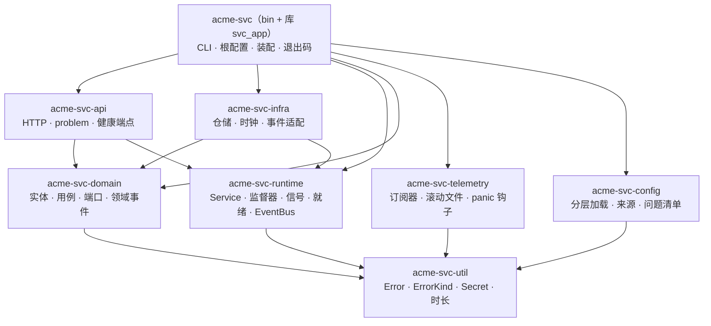

# rs-starter-template 第六版任务书

> 读者：执行本任务的 agent，以及审阅它的用户。
>
> 本任务书就是 V6 的设计。执行时不再另写一套设计稿，只在 `docs/log.md` 记录实施日志（§8.5）。
>
> 历史档案：`/Users/riotian/Developer/archive/rs-starter-template`，只读。下文用 `V4:` 表示 `rs-starter-template v4/template/crates/`，其中 `{{project-name}}` 简写为 `P`。

## 0. 一页摘要

| 项     | 内容                                                                                                                                  |
| ------ | ------------------------------------------------------------------------------------------------------------------------------------- |
| 目标   | `cargo generate RivTian/rs-starter-template` 得到一个优雅、开箱即用的 9 crate Rust 服务骨架（与 V1 至 V5 相同）                       |
| 不变   | 9 crate 五层、vendor 完整的 pingora-error、借 Pumpkin 的日志结构、prelude 与两段路径、HTTP 契约、CLI、退出码、模板工程（§3）          |
| 改变   | 错误的"身份"从字符串改为带类别的静态描述；运行时去掉服务依赖图；配置段归各 crate 所有；守卫只留理由明确的几条；流程大幅减重（§2、§5） |
| 已确认 | 5 个决定全部按推荐（§4）                                                                                                              |
| 流程   | P0 骨架 → P1 内核 → **停止：你读代码判断"顺不顺"** → P2 补全 → P3 审查 → **停止：交付**（§8）                                         |
| 规模   | 生成项目的非测试代码不超过约 5500 行（V4 约 7350 行），任何文件不超过 500 行（§7）                                                    |

## 1. 背景：五个版本走到了哪里

| 版本 | 结果                                                                                               | 留下什么                                                              |
| ---- | -------------------------------------------------------------------------------------------------- | --------------------------------------------------------------------- |
| V1   | 8 crate，约 5100 行，`thiserror` 分层枚举 + `Classify` trait，日志 34 行；能跑                     | 小而清楚的错误内核；设计稿与实现有漂移                                |
| V2   | 同一架构，按设计稿修了 10 处不一致（405、413、readyz 等）                                          | "设计即契约"的纪律                                                    |
| V3   | 定下 9 crate、vendor pingora-error、Pumpkin 日志；WP3 时停下                                       | 停在守卫的检查范围宽于理由（console feature → prost-derive → anyhow） |
| V4   | 实现到 WP10，98 个提交（48 个文档提交），约 1.7 万行；阶段 C 审出 59 条缺陷，修到第 9 条时整体回滚 | 能工作的实现与大量边界修复；以及"怪异感"                              |
| V5   | 只有设计：1.7 MB 设计稿，60 条待确认决策，141 条对外契约，86 条教训；任务书 472 KB                 | 有序事件通道 + 状态表的监督器思路；crate 内部结构规则                 |

V3 到 V5 每一版都用"更多规则、更多编号、更多文档"回应上一版的问题。V6 反过来：先找出怪异感的来源，从设计上消除它，再用更少的规则守住。

## 2. 诊断：V4 为什么"怪"

**总结论：V3 把两个参考实现（Pingora 是代理框架，Pumpkin 是游戏服务器）作为"零偏差"的固定决策引入，V4 的大量代码是在让一个业务服务模板去迁就代理框架的语义；每当迁就出问题，又靠加守卫、加文档来弥补。怪异感就是这种"迁就 + 弥补"的叠加。**

下面 7 条按影响大小排列。每条写现象（附档案中的证据）、根因和 V6 的改法。

### 2.1 错误的"身份"是字符串，含义靠运行期登记表找回

**现象。**

- 业务错误写成 `ErrorType::new("TodoNotFound")`，见 `V4:P-domain/src/errors.rs`。
- 每个 crate 还要另写一个 `TYPES` 切片，登记类别与标题。
- bin 的 `catalog()`（`V4:P/src/errors.rs`）把 8 组拼成一个 `ErrorCatalog`，放进 `AppState`。
- api 的 `outcome()`（`V4:P-api/src/error.rs`）在运行期按名字查回类别；没登记的类型静默变成 500。
- 为了发现漏登记，又写了 `tests/error_registry.rs`（306 行）扫描源码。

结果是加一个错误要改 3 处，外加一个守卫。登记表里还有 29 个 TLS、HTTP/2、代理连接类的上游预置类型，todo 服务一个都不会产生。配置、日志、生命周期的错误也登记了 HTTP 标题，可它们永远到不了 HTTP。

**根因。** Pingora 的 `ErrorType` 是为代理设计的封闭枚举，`Custom(&'static str)` 只是一个逃生口。把逃生口当作业务错误的主通道，"这是什么错误"就只剩一个字符串，类别只能登记在别处，运行期再查回来。

**V6。** 在 FD-3 允许的"新增"范围内，给 `ErrorType` 增加一个变体 `Kind(&'static ErrorKind)`。`ErrorKind` 是一个编译期常量，包含名字、类别和标题，所以类别随错误一起走，映射成为一个全函数 `match`。登记表、`TYPES`、`catalog()` 和注册表守卫全部删除，加一个错误只改 1 处（§5.2）。

### 2.2 为不会发生的上游状态修工事

**现象。**

- `RetryType::ReusedOnly` 是连接复用才有的语义，模板代码从未产生它。V4 仍然为它加了 `try_retry()`、`finalize()`、守卫 EI5，以及 `outcome()` 里的 `debug_assert`。
- 生成项目的文档要求每个适配器都 `.map_err(Error::finalize)`，但实际调用者为 0；阶段 C 的审查 C-14 也指出了这一点。
- `Display` 的前导空格先被测试钉死，日志字段里再 `trim()` 掉。
- `ErrorSource` × `ErrorClass` 是一张 10×3 的状态表，大部分格子是同一个值。

**根因。** "零偏差"（D-39）被执行成了"上游的每个怪癖都要配一套设施"。

**V6。** 原则改为：上游代码保持不动，但只为本模板真正会走到的路径写代码。

- 一条守卫保证 `ReusedOnly` 不出现在 vendor 文件之外，`retry()` 因此永远不会 panic，那套配套设施可以全部删掉。
- 日志字段直接取结构化成员，不经过 `Display`。
- 状态表压缩成一条规则："类别决定状态码，依赖导致的 4xx 记为 5xx"。

### 2.3 `core` 是一个缩小版的 Pingora Server

**现象。**

- `V4:P-core/src/server.rs` 有 814 行：服务依赖图、拓扑排序、Frontline 与 Background 两类服务、逐个服务的就绪状态。模板里实际只有两个服务：HTTP 和事件日志。
- 阶段 C 的 C-1：当一个依赖"就绪后立即退出"时，同一输入的退出码在 69 和 70 之间随机，原因是 `select!` 竞速。V5 的回应是再加一张状态表和一条有序事件通道。
- 为了进程级测试，bin 带了一个隐藏参数 `--debug-fault`（`V4:P/src/fault.rs`，204 行），把测试夹具编进了产品二进制。

**根因。** 照搬了 pingora-core 的服务模型，没有从"一个 HTTP 服务加若干后台任务"的实际需要出发。

**V6。**

- 去掉服务之间的依赖：所有服务同时启动，全部就绪即进入 Running。
- 保留 V5 的好想法：单一有序事件通道加一张写死的状态表，保证结果确定（§5.4）。
- 故障场景放到 runtime 的进程内测试里，用脚本化的服务覆盖，删除 `--debug-fault`。
- `core` 改名为 `runtime`（V6-3，已确认）。

### 2.4 `config` 是一个"全知"的低层 crate

**现象。**

- 所有配置段（server、lifecycle、log、events）都定义在 `V4:P-config/src/schema.rs`。core、api、telemetry 依赖 config，只是为了读自己那一段。
- 日志过滤串只有 telemetry 会解析。为了"一次报出全部问题"，bin 把 `svc_telemetry::plan::check_filter` 当作函数指针塞回加载器（`Inputs.checks`）。
- 配置校验失败时，整张问题清单被拼进一个 Pingora `Error` 的 `context` 字符串，bin 再把这个字符串取出来打印（`V4:P/src/bootstrap.rs` 的 `checked`）。
- `load.rs` 有 1019 行；阶段 C 已修的 9 条缺陷全在这里。

**根因。** 知识放错了方向：配置段的含义属于使用它的 crate，config 应当只提供机制。另外，"诊断清单"被当成了"错误"。

**V6。**

- 每个 crate 拥有自己的配置段类型，默认值和取值校验都写在那里。
- config 只负责分层加载、来源追踪、问题收集和 `check-config` 的渲染。
- bin 把各段拼成根 `Config`。
- 校验结果是数据（一个 `Report`，由若干 `Problem` 组成），不是 `Error`（§5.5）。

### 2.5 守卫比被守卫的东西还重

**现象。**

- `V4:P/tests/layering.rs` 有 880 行，`error_registry.rs` 有 306 行。
- 阶段 C 中缺陷最多的角度恰恰是守卫本身：13 条缺陷，外加 3 条承诺没有兑现。
- V3 停工的直接原因就是守卫的检查范围宽于它的理由。
- R9 要求每个 crate 都有 prelude，结果 `src/` 里 prelude 被使用了 0 次，其中 3 个是空文件，存在只是为了满足守卫。
- 生成项目的文档里带着 R1–R11、EI1–EI10 等内部编号。

**根因。** 每个问题都用"再加一条机械规则"来回应，规则本身成了需要维护的产品。

**V6。**

- 守卫只保留理由明确、检查范围等于理由的几条，每条用一句话写清理由（§5.9）。
- 生成项目里用名字称呼规则，不用编号。
- 不为满足守卫而创建任何文件。

### 2.6 crate 内部平铺

**现象。**

- `load.rs` 一个文件混了 8 块职责。
- `events.rs` 在 4 个 crate 里有 4 种含义。
- `error_catalog.rs`、`error_report.rs` 成了 `error.rs` 的兄弟文件。原因是 vendor 文件开头的模块级 `#![expect]` 会传给子模块，自有代码只能放在外面。

**V6。**

- vendor 代码合并成一个叶子私有模块 `error/pingora.rs`，lint 属性只作用于它自己；本模板的代码放在 `error/` 下的其他文件里，由 `error.rs` 作门面。
- 采用 V5 FD-7 的精简版（§5.7）：一个概念一个模块、按功能分组、共享词表、文件规模上限。

### 2.7 流程越来越重，品味越来越远

**现象。**

- 任务书从 194 KB 涨到 303 KB，再到 472 KB。
- V5 阶段 A 的设计稿有 1.7 MB。
- 用户真正的诉求是"优雅"和"层次感"，可直到 V5 它才第一次变成产品规则，在此之前一直淹没在验证机制里。

**根因。** 设计文档承担的是"证明自己没错"，而不是"让人读懂"；每一次失败都被转成了更多编号。

**V6。**

- 本任务书即设计，执行中只写简短的日志。
- 第一个停止点放在"能跑的内核代码"上：用户直接读代码判断品味，而不是读文档确认 60 个决定。
- 对外行为写成一张清单（§6），由测试守住，不靠脚本逐字比对文档。

## 3. 继承的决定（不再讨论）

| 项         | 决定                                                                                                                                                                          | 来源                   |
| ---------- | ----------------------------------------------------------------------------------------------------------------------------------------------------------------------------- | ---------------------- |
| 目标       | 优雅、开箱即用的多 crate Rust 服务骨架；失败、关停、配置出错、发布与容器也开箱即对                                                                                            | U7                     |
| crate      | 9 个，5 层，依赖只向下，同层互不可见；test-utils 只作 dev 依赖                                                                                                                | FD-1                   |
| 错误       | vendor pingora-error 0.9.0（`cloudflare/pingora@4487f7b`）的完整 `Error`，五个字段不删不改；Apache-2.0 头 + 修改声明 + `THIRD_PARTY_NOTICES.md`；随镜像与压缩包分发许可证全文 | FD-3、D-7、U15         |
| 禁用依赖   | 成员不得直接依赖 anyhow、eyre、color-eyre、failure；第三方内部使用不管                                                                                                        | U26、D-12              |
| 日志       | `-telemetry` 借 Pumpkin 的结构：配置驱动组装订阅器、gzip 滚动文件、`log_at_level!`；只有 bin 初始化                                                                           | FD-2、D-4、D-5、D-35   |
| 公开路径   | prelude 是唯一的扁平出口；顶层模块可以作门面 `pub use` 私有子模块的项；公开路径两段；`lib.rs` 只声明模块                                                                      | FD-4、U32              |
| 快照与自足 | 不提交 `generated/`；生成项目不出现设计编号与上游 `path:line`                                                                                                                 | FD-5、FD-6             |
| 名字       | 目录 = 包名；库名 `svc_<role>`，bin 的库名 `svc_app`，与项目名无关                                                                                                            | D-16                   |
| HTTP       | axum 0.8；成功返回裸 JSON（200、201 + `Location`、202、204）；失败返回 `application/problem+json`，带 `request_id`，5xx 不暴露 detail                                         | D-1、D-17              |
| CLI        | `run`、`check-config`、`probe`；`--config`、`--http-addr`、`--log-filter`、`--log-format`                                                                                     | D-30                   |
| 健康       | `/livez`、`/readyz`                                                                                                                                                           | D-31                   |
| 配置来源   | 默认值 < 文件（`--config` 或 `<PREFIX>_CONFIG`）< `RUST_LOG`（只作用于 `log.filter`）< `<PREFIX>_<SECTION>__<KEY>` < 命令行；未知键报错；不含 `__` 的前缀变量不是配置         | D-32                   |
| 工具       | just、nextest（doctest 另跑）、edition 2024、MSRV 1.88、resolver 3、vergen-gitcl                                                                                              | D-19、D-20、D-23、D-24 |
| 占位符     | `license`（MIT、Apache-2.0、None）、`with_docker`、`with_ci`；cargo-generate ≥ 0.24.0                                                                                         | D-26、D-14             |
| 容器       | 多阶段构建 + distroless `cc-debian12:nonroot` + 内置 `probe`；tag 触发发布；提交 `Cargo.lock`                                                                                 | D-27                   |
| 示例       | todo，带版本号的乐观并发；`Arc<dyn Port>` 注入；每个功能在 domain 定义自己的事件发布端口                                                                                      | D-15、D-36、D-22       |
| lint       | V4 的组合 + `print_stdout`、`print_stderr` deny；冲突时用局部 `#[expect(.., reason = "..")]`                                                                                  | D-25                   |
| 仓库       | 模板放在 `template/`；模板仓库本身 MIT OR Apache-2.0                                                                                                                          | D-13、D-38             |

## 4. 开工前请用户确认的 5 个决定

**确认记录：2026-10-04，用户回复"按推荐"——V6-1 至 V6-5 全部采用推荐值（A）。** 本节保留选项与理由，供日后回溯。

| ID   | 决定             | 选项                                                                                                                                         | 推荐 | 理由                                                                                                 |
| ---- | ---------------- | -------------------------------------------------------------------------------------------------------------------------------------------- | ---- | ---------------------------------------------------------------------------------------------------- |
| V6-1 | 错误身份         | A 在 vendor 的 `ErrorType` 中新增变体 `Kind(&'static ErrorKind)`；B 把 `Custom` 的载荷改为 `&'static ErrorKind`；C 维持 V4 的字符串 + 登记表 | A    | A 是纯新增，上游 32 个变体与语义不变，符合 FD-3 的"允许新增"；B 改变了既有变体；C 是怪异感的主要来源 |
| V6-2 | 配置段归属       | A 各 crate 拥有自己的配置段，config 只提供机制，只被 bin 使用；B 维持 config 集中定义全部 schema                                             | A    | 消除过滤串校验的函数指针注入；runtime、api、telemetry、infra 不再依赖 config                         |
| V6-3 | `core` 改名      | A 改名为 `-runtime`（库名 `svc_runtime`）；B 保留 `-core`                                                                                    | A    | "core"容易被理解为业务核心；它实际是进程运行时（pingora-core 的同名来自代理框架）                    |
| V6-4 | 运行时简化       | A 去掉服务依赖图与 `--debug-fault`，故障由进程内测试覆盖；B 保留 V4 的模型                                                                   | A    | 依赖图正是 C-1 竞速的触发场景；测试夹具不应进入产品二进制                                            |
| V6-5 | 能否移植 V4 代码 | A 按附录 B 的复用表有选择地移植，并改造为 V6 的设计；B 全部从零写                                                                            | A    | V4 已修好大量边界（附录 A），从零写会重演一遍；复用表限定了范围                                      |

## 5. V6 设计

### 5.1 分层与依赖

**结论：层次与 V4 相同；变化是 config 与 telemetry 都只被 bin 使用，其他 crate 不再依赖 config。**



允许的依赖（守卫的数据，§5.9）：

| crate      | 层  | 可以依赖              | 与 V4 相比          |
| ---------- | --- | --------------------- | ------------------- |
| util       | L0  | 无                    | 相同                |
| domain     | L1  | util                  | 相同                |
| config     | L1  | util                  | 相同，只被 bin 使用 |
| runtime    | L2  | util                  | 去掉 config         |
| telemetry  | L2  | util                  | 去掉 config         |
| api        | L3  | domain、runtime、util | 去掉 config         |
| infra      | L3  | domain、runtime、util | 去掉 config         |
| bin        | L4  | 全部                  | 相同                |
| test-utils | dev | domain、runtime、util | 去掉 config         |

### 5.2 错误内核

**结论：`Error` 仍是上游的五字段结构；本模板只新增一个 `ErrorType` 变体和一个类别枚举；错误的类别随错误走，任何地方都不需要登记表。**

vendor 文件的唯一语义改动（示意）：

```rust
// util/src/error/pingora.rs：上游 lib.rs 与 immut_str.rs 合并，32 个变体与全部语义原样保留
pub enum ErrorType {
    // ... 上游的 32 个变体 ...
    /// 本服务定义的错误种类（本模板新增）。
    Kind(&'static ErrorKind),
}
// as_str() 增加一个分支：ErrorType::Kind(kind) => kind.name()
```

本模板新增的类型（示意）：

```rust
// util/src/error/kind.rs
/// 失败的性质，与传输无关；HTTP 状态码只在 api 里由它推出。
pub enum Class { InvalidInput, Unauthenticated, Forbidden, NotFound, Conflict,
                 TooManyRequests, Unavailable, Timeout, Internal }

/// 一个错误种类：名字（出现在日志与 problem type 中）、类别、给调用方看的标题。
pub struct ErrorKind { name: &'static str, class: Class, title: &'static str }

impl ErrorType {
    /// 全函数：上游预置变体在这里一次性归类；上游新增变体时编译器会报错。
    pub const fn class(&self) -> Class { /* match self { Self::Kind(k) => k.class, ... } */ }
}

// domain/src/todo/error.rs：定义一个错误只需一行
pub const TODO_NOT_FOUND: ErrorType =
    ErrorType::Kind(&ErrorKind::new("TodoNotFound", Class::NotFound, "Todo not found"));
```

`util/src/error.rs` 是门面：`mod pingora; mod kind; mod report;`，再 `pub use` 公开项，公开路径为 `svc_util::error::Error`、`svc_util::error::ErrorKind` 等。

规则（生成项目的 `docs/architecture.md` 用名字写出，不编号）：

| 规则         | 内容                                                                                                                                                      |
| ------------ | --------------------------------------------------------------------------------------------------------------------------------------------------------- |
| 一处定义     | 每个错误种类是所在 crate（或功能目录）`error.rs` 中的一个 `const`                                                                                         |
| 三个名字不用 | `Custom`、`CustomCode`、`ReusedOnly` 不出现在 vendor 文件之外（守卫）；`HTTPStatus` 只在 api 构造                                                         |
| 归属         | 适配器把依赖导致的失败标为 `into_up()`；api 把请求本身的问题标为 `into_down()`；其他情况不设                                                              |
| 重试         | 默认不重试；适配器确知可以重试时调用 `set_retry(true)`                                                                                                    |
| 只记一次     | 错误只在被处理的地方记一次日志：HTTP 层回答时，或监督器收到服务失败时                                                                                     |
| 日志字段     | `error.type`、`error.class`、`error.source`、`error.retry`、`error.context`、`error.chain`（类型名以逗号连接，外来错误记为 `external`）；不使用 `Display` |
| 诊断不是错误 | 配置问题清单等"一组诊断"用数据类型表示，不塞进 `Error` 的 `context`                                                                                       |

HTTP 映射（api 中的一个函数，全函数 `match`）：

| `Class`         | 状态码 | 依赖导致时（`esource == Upstream`） |
| --------------- | ------ | ----------------------------------- |
| InvalidInput    | 422    | 500                                 |
| Unauthenticated | 401    | 500                                 |
| Forbidden       | 403    | 500                                 |
| NotFound        | 404    | 500                                 |
| Conflict        | 409    | 500                                 |
| TooManyRequests | 429    | 503                                 |
| Unavailable     | 503    | 503                                 |
| Timeout         | 504    | 504                                 |
| Internal        | 500    | 500                                 |

`HTTPStatus(code)` 直接使用 `code`。状态码决定其余三项：

- 日志级别：429、503、504 为 warn；其他 5xx 为 error；4xx 为 debug。
- 是否暴露 `detail`：4xx 中除 401、403 外暴露。
- `Retry-After: 1`：仅当状态码为 429 或 503 且 `retry` 为真。

删除的内容：`ErrorCatalog`、`ErrorSpec`、`PREDEFINED`、各 crate 的 `TYPES`、bin 的 `catalog()`、`tests/error_registry.rs`、`try_retry()`、`finalize()`、`AppState.catalog`、`ErrorClass::Transport`（上游的传输类变体归入 `Unavailable` 或 `Internal`）。

### 5.3 HTTP 响应契约

**结论：契约与 V4 相同；渲染不再需要运行期状态。**

- handler 返回 `Result<ApiResponse<T>, ApiError>`。`ApiResponse` 有 `Ok`、`Created { location, body }`、`Accepted`、`NoContent` 四种。
- `ApiError(BError)` 的 `into_response` 生成一个空响应，并把 `Arc<Error>` 放进响应扩展。`BError` 不能 Clone，而 http 的扩展要求 Clone，所以用 `Arc`。
- 唯一的 problem 中间件负责渲染所有失败，包括 handler 的错误、提取器的拒绝、404、405、413、超时、panic、序列化失败。它补上 `instance`（请求路径）和 `request_id`，记一次日志。
- `request_timeout` 由这个中间件用 `tokio::time::timeout` 实现，超时回答 503 problem。tower-http 只开 `catch-panic`。
- problem 文档的成员：`type`、`title`、`status`、`detail`、`instance`、`request_id`。
  - `type`：带 `ErrorKind` 的 4xx 为 `urn:<name>:problem:<kebab 名字>`，其余为 `about:blank`。
  - `title`：前一种情况用 `ErrorKind` 的标题，否则用状态码的标准短语。

### 5.4 运行时与监督器

**结论：服务之间没有依赖；所有输入经过一条有序通道，由一个循环按下表处理，同一输入总是得到同一结果。**

服务契约（示意）：

```rust
#[async_trait]
pub trait Service: Send + 'static {
    fn name(&self) -> &'static str;
    fn kind(&self) -> Kind { Kind::Background }      // Frontline：对外接流量
    /// 能工作时调用 ctx.ready()；ctx.shutdown() 完成时返回。
    async fn run(self: Box<Self>, ctx: ServiceContext) -> Result<()>;
}
```

监督循环：

- 所有服务一起启动。它们的 ready、退出、panic，以及信号和各个计时器到期，都作为事件进入同一条 `mpsc` 通道，由一个循环串行处理。不使用无 `biased` 的 `select!` 竞速。
- 第一个决定下来的停止原因有效；之后的事件只追加日志，不改变退出码。只有两个例外：二次信号会中止；停止过程中服务出错时，信号原因会改为故障。

状态表（每一行都要有测试，§5.9）：

| 事件                     | Starting                 | Running                                   | Draining                   | Stopping                                     |
| ------------------------ | ------------------------ | ----------------------------------------- | -------------------------- | -------------------------------------------- |
| 服务调用 `ready()`       | 全部就绪 → Running       | -                                         | -                          | -                                            |
| 服务返回 `Ok`            | 启动失败（69）→ Stopping | 前台：故障（70）→ Stopping；后台：记 info | 记录                       | 记录                                         |
| 服务返回 `Err` 或 panic  | 启动失败（69）→ Stopping | 故障（70）→ Stopping                      | 原因为信号时改为故障（70） | 原因为信号时改为故障（70）                   |
| `startup_timeout` 到期   | 启动失败（69）→ Stopping | -                                         | -                          | -                                            |
| 第一次 SIGTERM           | 信号 → Stopping          | 信号 → Draining                           | -                          | -                                            |
| 第一次 SIGINT            | 信号 → Stopping          | 信号 → Stopping                           | -                          | -                                            |
| 之后的 SIGTERM 或 SIGINT | -                        | -                                         | 中止（128+n），立即退出    | 中止（128+n），立即退出                      |
| SIGHUP                   | warn，忽略               | warn，忽略                                | warn，忽略                 | warn，忽略                                   |
| `drain_delay` 到期       | -                        | -                                         | → Stopping                 | -                                            |
| `drain_timeout` 到期     | -                        | -                                         | -                          | 原因为信号时记为排空超时（75）；放弃剩余服务 |
| 全部服务已退出           | -                        | -                                         | -                          | Stopped，按原因给出退出码（信号为 0）        |

各阶段的行为：

- **Draining**：`/readyz` 立即回答 503，但继续服务请求。
- **Stopping**：先取消前台服务；前台全部退出后，再取消后台服务。`drain_timeout` 从进入 Stopping 时开始计时。
- **HTTP 服务**：绑定成功后调用 `ready()`，用 axum 的 `with_graceful_shutdown`。截止时间到时返回，由运行时的 `shutdown_timeout` 结束残留的连接任务。

### 5.5 配置

**结论：config 只认识泛型 `T`；配置段的含义和校验属于拥有它的 crate；问题清单是数据。**

```rust
// bin/src/settings.rs（示意）：根配置由 bin 拼装
#[derive(Default, Serialize, Deserialize)]
#[serde(default, deny_unknown_fields)]
pub struct Config {
    pub server: svc_api::settings::ServerSettings,
    pub lifecycle: svc_runtime::settings::LifecycleSettings,
    pub events: svc_runtime::settings::EventSettings,
    pub log: svc_telemetry::settings::LogSettings,
}

// config（示意）：只提供机制
pub fn load<T: Serialize + DeserializeOwned + Default>(inputs: &Inputs<'_>) -> Result<Loaded<T>, Report>;
pub struct Report { pub problems: Vec<Problem> }      // 每条：键、来源、说明
```

- **取值校验**：时长与整数的范围、非空等通用校验器放在 `svc_util::settings`；过滤串的校验器放在 telemetry 自己的 `settings.rs`。它们都在加载时运行，所以所有问题一次报出，不再需要函数指针注入。
- **加载语义**：沿用 V4 `load.rs` 的语义，包括阶段 C 已修的 9 条，以及附录 A 中配置相关的条目。按来源拆成 `load/file.rs`、`load/env.rs`、`load/cli.rs`、`load/merge.rs` 等，每个文件不超过 400 行。
- **配置键**（14 个）：
  - `server.http_addr`、`server.request_timeout`、`server.body_limit_bytes`
  - `lifecycle.startup_timeout`、`lifecycle.drain_delay`、`lifecycle.drain_timeout`
  - `events.capacity`
  - `log.format`、`log.filter`、`log.color`
  - `log.file.enabled`、`log.file.dir`、`log.file.filter`、`log.file.max_archives`

  默认值与范围沿用 V4 的 `docs/architecture.md`。V4 的 `log.ansi` 改名为 `log.color`：取值 `auto`、`always`、`never`；`auto` 只在终端上着色，并尊重 `NO_COLOR` 与 `TERM=dumb`。删除 `log.target`、`log.thread_names`、`log.thread_ids`：target 固定显示，线程信息固定不显示。
- **默认监听地址**：`127.0.0.1:8080`；容器镜像中设为 `0.0.0.0:8080`。

### 5.6 日志（telemetry）

**结论：沿用 V5 07 的设计（`rs-starter-template v5/docs/design/07-telemetry.md`），但入口收敛为两个函数，并修掉 V4 遗留的问题。**

| 项    | 设计                                                                                                                                                                                 |
| ----- | ------------------------------------------------------------------------------------------------------------------------------------------------------------------------------------ |
| 输出  | stdout：`auto` 在终端为 text，否则为 JSON。文件：可选，text，按 UTC 日期滚动并压缩为 `.log.gz`，保留 `max_archives` 份。每个输出层有自己的 `EnvFilter`，没有全局过滤层               |
| 入口  | `svc_telemetry::subscriber::init(&LogSettings, &Env) -> Result<Guard>` 只在 `run` 中调用；`svc_telemetry::subscriber::build(..)` 是正式的公开 API，测试也用它，不用 `#[doc(hidden)]` |
| panic | 最早安装的 panic 钩子先写 stderr；日志就绪后改为记 `target = "panic"` 的 error；过滤为 `off` 时仍然写 stderr                                                                         |
| 桥接  | `log` 的记录转成 `tracing` 事件                                                                                                                                                      |
| 宏    | `svc_util::log_at_level!`，宏体用 `event!`，支持带点的字段名                                                                                                                         |
| 可选  | `console` feature（tokio-console），需要 `--cfg tokio_unstable`，缺少时报出清楚的错误                                                                                                |
| 必修  | 文件层使用另一种字段格式化器类型，避免字段重复和 ANSI 转义泄漏（C-37）；再次 `init` 不得归档正在写的文件                                                                             |

### 5.7 crate 内部结构与公开路径

**结论：用 5 条规则和一张词表代替 V5 的 M1 至 M12。**

| 规则         | 内容                                                                                                     | 检查            |
| ------------ | -------------------------------------------------------------------------------------------------------- | --------------- |
| 一概念一模块 | 一个模块只讲一件事；业务代码按功能分组（`todo.rs` + `todo/`）；不用 `foo_bar.rs` 兄弟文件表达从属        | 评审            |
| 目录模块     | 用 `foo.rs` + `foo/`，不用 `mod.rs`；顶层模块之下最多再嵌一层目录                                        | 模板仓库的 lint |
| 规模         | 文件不超过 500 行（含测试）；代码部分超过 300 行要在日志中说明理由                                       | 模板仓库的 lint |
| 门面         | `lib.rs` 只声明模块；顶层模块可以 `pub use` 私有子模块的项；公开路径两段；不用 glob 再导出               | 评审 + lint     |
| prelude      | 只在有下游使用者的 crate 建（util、domain、runtime）；下游实际用 `use svc_x::prelude::*`；不建空 prelude | 评审            |

共享词表（同一个文件名在所有 crate 中只有一种含义）：

| 名字                          | 含义                                     |
| ----------------------------- | ---------------------------------------- |
| `error.rs`                    | 本 crate 或本功能定义的错误种类常量      |
| `settings.rs`                 | 本 crate 拥有的配置段类型                |
| `ports.rs`                    | 领域需要的外部能力（trait），只在 domain |
| `events.rs`                   | 领域事件类型，只在 domain 的功能目录     |
| `usecases.rs`                 | 用例，只在 domain 的功能目录             |
| `bus.rs`                      | 进程内事件总线，只在 runtime             |
| `service.rs`                  | `Service` 契约，只在 runtime             |
| `server.rs`                   | HTTP 服务（实现 `Service`），只在 api    |
| `<feature>.rs` + `<feature>/` | 一个业务功能                             |

目标模块树（示意；执行时可以调整，调整要在日志里记一句）：

```text
util       error.rs  error/{pingora,kind,report}.rs  settings.rs  duration.rs  secret.rs  log.rs  prelude.rs
domain     todo.rs   todo/{model,usecases,ports,events,error}.rs  clock.rs  prelude.rs
runtime    service.rs  supervisor.rs  supervisor/{table,events}.rs  signal.rs  phase.rs  health.rs  bus.rs  settings.rs  error.rs  prelude.rs
telemetry  settings.rs  subscriber.rs  subscriber/{stdout,file,console}.rs  rolling.rs  panic.rs  error.rs
config     load.rs  load/{file,env,cli,merge}.rs  source.rs  report.rs  table.rs
api        server.rs  router.rs  state.rs  settings.rs  problem.rs  problem/status.rs  response.rs  extract.rs
           middleware.rs  middleware/{request_id,access}.rs  health.rs  todo.rs  error.rs
infra      memory.rs  memory/todo.rs  clock.rs  event_log.rs  publisher.rs
test-utils repo.rs  services.rs  signals.rs  clock.rs
bin        main.rs  lib.rs  cli.rs  settings.rs  bootstrap.rs  wiring.rs  exit.rs  probe.rs  build_info.rs  names.rs
```

### 5.8 加一个功能要改几处

这一节同时是 P1、P3 评审的度量标准。

| 你要加       | 改哪里                                              | V4 要改几处                         | V6 目标 |
| ------------ | --------------------------------------------------- | ----------------------------------- | ------- |
| 一个错误     | 功能目录的 `error.rs` 加一个 `const`                | 3 处 + 守卫                         | 1 处    |
| 一个配置键   | 所属 crate 的 `settings.rs`；`config/example.toml`  | config 的 schema + 使用处 + example | 2 处    |
| 一个端点     | api 的功能模块（handler + DTO）；`router.rs` 加一行 | 2 处                                | 2 处    |
| 一个后台任务 | infra 实现 `Service`；`wiring.rs` 注册一行          | 2 处 + 可能声明依赖                 | 2 处    |
| 一个业务功能 | domain、infra、api 各一个功能模块；`wiring.rs`      | 同左 + 错误登记                     | 同左    |

### 5.9 测试与守卫

测试：

| 种类      | 位置                          | 内容                                                                                                                     |
| --------- | ----------------------------- | ------------------------------------------------------------------------------------------------------------------------ |
| 单元      | 模块内 `#[cfg(test)]`         | 纯逻辑                                                                                                                   |
| 错误映射  | `api/tests/problem.rs`        | §5.2 表的每一行；`expose`、`Retry-After`、日志级别                                                                       |
| HTTP 契约 | `api/tests/contract.rs`       | 每种成功与失败的形态，经过 router                                                                                        |
| 监督器    | `runtime/tests/supervisor.rs` | §5.4 表的每一个非空格子；脚本化服务 + `tokio::time::pause`；每个场景循环 50 次，结果必须相同                             |
| 仓储契约  | test-utils `repo.rs`          | 真仓储与替身跑同一组用例；把版本比较去掉时，并发用例必须失败（植入一次，记入日志）                                       |
| 配置      | `config/tests/`               | 来源优先级、未知键、一次报出全部问题、附录 A 的配置条目                                                                  |
| 日志      | `telemetry/tests/`            | 输出组合（stdout × 文件 × 格式）、滚动与保留、文件中无 ANSI 与重复字段                                                   |
| 进程      | `bin/tests/process.rs`        | 真二进制：退出码 0、64、69（端口被占用）、78；SIGTERM；二次信号；`check-config` 输出；`--version`；`probe`；输出管道关闭 |
| 架构      | `bin/tests/architecture.rs`   | 下表的守卫                                                                                                               |

测试统一返回 `Result` 并使用 `?`，因为 lint 禁止 `unwrap` 和 `expect`。

生成项目中的守卫（一个文件，不超过 300 行；数据来自 `cargo metadata` 与 manifest）：

| 守卫                                                                         | 理由                       | 范围                                          |
| ---------------------------------------------------------------------------- | -------------------------- | --------------------------------------------- |
| 成员之间的依赖只走 §5.1 的允许表                                             | 分层                       | normal 与 build 依赖                          |
| util、domain、config 的运行时闭包中没有 tokio 与网络 crate                   | 领域与配置在任何地方都能测 | 默认 features；不进入 proc-macro              |
| runtime、telemetry 的运行时闭包中没有 HTTP 栈                                | 运行时与日志不绑定传输     | 默认 features（`console` feature 不在范围内） |
| test-utils 只作 dev 依赖                                                     | 替身不进入二进制           | 所有成员                                      |
| 不直接依赖 anyhow、eyre、color-eyre、failure                                 | 一个错误模型               | 只查直接依赖                                  |
| 依赖版本只在 `[workspace.dependencies]`；每个成员 `[lints] workspace = true` | 一处升级、一套 lint        | manifest                                      |
| `Custom`、`CustomCode`、`ReusedOnly` 不出现在 vendor 文件之外                | §5.2                       | `crates/*/src` 的文本搜索                     |

每条守卫有一个反例测试（改动描述数据，断言报出的正是这一条）即可，不追求覆盖各种"变体写法"。

### 5.10 模板工程

**结论：沿用 V4 的模板工程，脚本总量收敛。**

- `cargo-generate.toml`：
  - `.rs` 文件不经 Liquid 渲染，只有 `names.rs` 与 `tests/support/bin.rs` 例外。
  - 三个占位符；条件忽略许可证文件、Docker、CI。
  - `init` 与 `pre` 两个 hook 校验项目名，包括与依赖同名的情况（附录 A）。
- 渲染矩阵为 5 个组合（V5 D-28），包含 `None` + Docker + 无 CI。
- 维护者脚本：
  - `render`：渲染到临时目录。
  - `check`：在每个组合中跑生成项目自己的 `just check`。
  - `template-lint`：FD-6 扫描、vendor 许可头、文件规模、Liquid 残留。
  - `names`：项目名边界。
  - `version-info`：git 场景。
  - 合计不超过约 1200 行。
- 模板仓库自己的 CI：`template-ci.yml`。
- 生成项目的 `just` 配方：`dev`、`check`、`test`、`fmt`、`lint`、`deny`、`docker`、`package`、`console`。

## 6. 对外行为清单

**结论：下面是生成项目对外承诺的全部行为；测试守住它们；措辞不在本表里写死的，以 V4 实现的文本为准（附录 B），改动要记日志。**

命令行：

| 命令                             | 行为                                                                                                                                                               |
| -------------------------------- | ------------------------------------------------------------------------------------------------------------------------------------------------------------------ |
| `<name> run [覆盖参数]`          | 运行服务，直到信号或故障                                                                                                                                           |
| `<name> check-config [覆盖参数]` | 通过时 stdout 打印 `configuration is valid`，再打印"键、值、来源"三列表（按键排序，按字符计宽，控制字符转义，`Secret` 显示为 `<redacted>`），退出 0；失败时退出 78 |
| `<name> probe <URL>`             | 对 URL 发一次 HTTP/1.1 GET（不读配置、不启动日志）；依次尝试所有解析出的地址；2xx 无输出退出 0，否则 stderr 一行并退出 1                                           |
| `<name> --version`               | `<name> <version> (<sha7>)`；没有 git 信息时为 `(unknown)`                                                                                                         |
| 配置错误                         | stderr 每个问题一行：`<name>: invalid configuration: <key> (<source>): <说明>`                                                                                     |

退出码：

| 码      | 含义                                                     |
| ------- | -------------------------------------------------------- |
| 0       | 信号后正常停止；`check-config` 通过；帮助或版本          |
| 1       | 只用于 `probe`：没有得到 2xx                             |
| 64      | 命令行错误                                               |
| 69      | 启动失败：服务在就绪前退出或失败，或启动超时，或端口被占 |
| 70      | 运行中故障；或停止过程中服务出错                         |
| 71      | 运行时或信号处理器无法建立                               |
| 73      | 日志无法启动（如日志目录不可创建）                       |
| 75      | 信号触发的停止在截止时间到时仍有请求未完成               |
| 78      | 配置无效                                                 |
| 101     | 主线程 panic（缺陷）                                     |
| 128 + n | 第二个信号中止了停止过程                                 |

HTTP：

| 端点                                       | 成功                                                      | 主要失败                                                     |
| ------------------------------------------ | --------------------------------------------------------- | ------------------------------------------------------------ |
| `GET /livez`                               | 200 `{"status":"live"}`                                   | -                                                            |
| `GET /readyz`                              | 200 `{"status":"ready","phase":"running","checks":{...}}` | 503 `"not ready"` + 阶段 + 检查                              |
| `POST /v1/todos` `{title}`                 | 201 + `Location` + todo                                   | 422 标题非法                                                 |
| `GET /v1/todos?limit=N`                    | 200 数组，最旧的在前；`limit` 默认 50，范围 1 至 500      | 400 `limit` 非法                                             |
| `GET /v1/todos/{id}`                       | 200 todo                                                  | 404；400 id 非法                                             |
| `POST /v1/todos/{id}/complete` `{version}` | 200 todo                                                  | 404；409 版本冲突                                            |
| `DELETE /v1/todos/{id}`                    | 204                                                       | 404                                                          |
| 请求体                                     | -                                                         | JSON 语法错误 400；形状不符 422；超过 `body_limit_bytes` 413 |
| 任何失败                                   | -                                                         | problem+json（§5.3）                                         |

请求头：

- `x-request-id`：传入的值由 1 至 128 个 `A-Za-z0-9._-` 组成时沿用，否则生成 UUIDv7；响应中回写同一个值。
- `Retry-After: 1`：条件见 §5.2。

日志（字段名采用 OpenTelemetry 语义约定，与 V4 相同）：

| 事件               | 级别             | 关键字段                                     |
| ------------------ | ---------------- | -------------------------------------------- |
| `starting`         | info             | `service.name`、`service.version`、`git_sha` |
| `configuration`    | info             | `overrides`：不是默认值的键                  |
| `listening`        | info             | `http.addr`                                  |
| 阶段变化           | info             | `phase`、`reason`                            |
| `request finished` | info             | target `svc_api::access`；请求 span 的字段   |
| `request failed`   | 按 §5.2          | 错误字段 + `http.response.status_code`       |
| `service failed`   | error            | `service.name` + 错误字段                    |
| `drain timed out`  | warn（只记一次） | `in_flight`                                  |
| `stopped`          | info             | `exit_code`                                  |

请求 span 名为 `request`，字段包括 `http.request.method`、`url.path`、`http.route`、`http.response.status_code`、`client.address`、`request_id`。

## 7. 规模预算

超出软上限时在日志中写一句理由；超出硬上限视为未完成。

| 对象                                      | V4     | V6 上限            |
| ----------------------------------------- | ------ | ------------------ |
| 生成项目非测试代码（含 vendor 约 760 行） | ~7350  | 5500（软）         |
| 生成项目测试代码（`tests/` + 内联测试）   | ~7800  | 5000（软）         |
| 任意一个 `.rs` 文件                       | 1019   | 500（硬）          |
| 监督器（`supervisor.rs` + `supervisor/`） | 814    | 450（软）          |
| 配置加载（`load.rs` + `load/`）           | 1019   | 800（软）          |
| 架构守卫测试                              | 880    | 300（软）          |
| 生成项目 `docs/architecture.md`           | 298    | 250（软）          |
| 模板仓库维护脚本                          | ~1700  | 1200（软）         |
| 本任务之后新写的设计类文档                | 1.7 MB | 只有 `docs/log.md` |

## 8. 执行流程

### 8.1 边界

- **工作位置**：仓库 `/Users/riotian/Developer/personal/rs-starter-template`，分支 `main`，只在本地提交，不 push。
- **档案**：只读，可以复制附录 B 中列出的文件。
- **不做新的调研**：V3 至 V5 的研究报告在档案的 `docs/design/references/` 中，按需查证即可。
- **用户环境**：
  - 不改动 `~/.cargo` 中已安装的工具、rustup、shell 与 git 配置。缺少工具时先报告，不擅自安装。
  - Docker 只创建和删除带 `rs-starter-template-check` 前缀的镜像，绝不删除已有镜像。
- **子 agent**：只在 P3 用于审查，最多 3 个，只读。

### 8.2 阶段

| 阶段 | 内容                                                                                                                                                                                                        | 结束条件                                                        |
| ---- | ----------------------------------------------------------------------------------------------------------------------------------------------------------------------------------------------------------- | --------------------------------------------------------------- |
| P0   | 模板仓库骨架：`template/`、`cargo-generate.toml`、hooks、渲染脚本、根 `justfile`、9 个空 crate 与 workspace 配置、架构守卫                                                                                  | 默认组合渲染后 `just check` 通过                                |
| P1   | 内核：util 错误内核（vendor + `ErrorKind`）、domain 的 todo、runtime 监督器、api 的 problem 与 todo 端点、infra 内存仓储、bin 最小装配（只用默认配置、stdout 日志）；§5.9 的错误映射、HTTP 契约、监督器测试 | **停止**：汇报，并请用户读 §8.3 列出的文件，按 §10 判断"顺不顺" |
| P2   | 补全：config 全部语义、telemetry 全部能力、CLI、`check-config`、`probe`、版本信息、Docker、CI、生成项目文档、5 个组合的矩阵、附录 A 的全部条目                                                              | 5 个组合全部通过 `just check`，镜像构建与 `probe` 通过          |
| P3   | 审查：最多 3 个只读子 agent，分别从运行时与 HTTP、配置与日志、模板工程三个角度审查，依据 §10、附录 A 和 §7；主会话逐条复现后修复                                                                            | **停止**：交付汇报                                              |

### 8.3 P1 停止时请用户读的文件

- `util/src/error.rs` 与 `util/src/error/kind.rs`
- `domain/src/todo/usecases.rs` 与 `domain/src/todo/error.rs`
- `api/src/problem.rs`
- `runtime/src/supervisor.rs`
- `bin/src/wiring.rs`

### 8.4 每个提交

- 使用 Conventional Commits；一个提交做一件事。
- 每个提交前跑生成项目的 `just check`（默认组合，约 5 分钟内）：fmt、clippy（默认与 `--all-features`）、nextest、doctest。
- 阶段结束时跑完整矩阵。
- 失败的检查不得标为通过；没有跑的检查，汇报中写明"未验证"。

### 8.5 实施日志与设计变更

`docs/log.md` 每个阶段一节，每节不超过一屏：

- 做了什么、提交范围；
- 跑了哪些检查，结果如何；
- 偏离本任务书的地方（一行一条：位置、原因）；
- 超出规模预算的理由；
- 未验证项。

遇到下面三种情况时先停下来问用户，不要先实现再追认：

- 偏离 §2 的诊断、§4 的决定、§6 的对外行为；
- 要增加新的守卫或新的配置键；
- 要增加新的依赖 crate。

其余的实施细节自行决定，并在日志中记一句。

### 8.6 汇报格式

每次停止时的汇报：

- 3 至 5 行结论；
- 检查命令与结果；
- 未验证项；
- 需要用户决定的事（如果有）；
- P1 另附 §8.3 的文件列表，以及 §5.8 每一行在当前代码中实际要改几处。

## 9. 验收标准

| 范围   | 标准                                                                                                            |
| ------ | --------------------------------------------------------------------------------------------------------------- |
| 设计   | §2 每一条诊断在代码中都已消除（P3 审查逐条确认）；§5.8 的 V6 目标全部达成                                       |
| 行为   | §6 每一行都有通过的测试；附录 A 每一条都有测试，或在生成项目文档中写明不支持                                    |
| 确定性 | 监督器的每个场景循环 50 次结果相同                                                                              |
| 规模   | §7 没有超出硬上限的项；超出软上限的项有理由                                                                     |
| 矩阵   | 5 个组合在仓库外渲染后通过 `just check`；cargo-generate 0.24.0 与最新版的渲染结果一致；镜像与压缩包含许可证全文 |
| 自足   | 生成项目中没有设计编号、没有上游 `path:line`、没有空 prelude、没有 `#[doc(hidden)]` 的测试入口                  |

## 10. 怪异感检查表

P1 停止时由用户使用，P3 审查时由审查者逐条回答。每条要回答"是/否 + 证据位置"。

| 问题                                                                                | 期望 |
| ----------------------------------------------------------------------------------- | ---- |
| 加一个错误、配置键、端点、后台任务，实际要改几处？是否与 §5.8 一致？                | 一致 |
| 有没有为本模板走不到的状态写的代码（防御、守卫、文档要求）？                        | 没有 |
| 有没有运行期的登记表、按名字查找、字符串拼接出来的契约，本可以用类型表达？          | 没有 |
| 有没有只为满足守卫或规则而存在的文件、函数、测试？                                  | 没有 |
| 有没有为测试而编进产品二进制的代码？                                                | 没有 |
| 打开任一 crate 的 `lib.rs`，30 秒内能否说出它的职责与公开面？                       | 能   |
| 同一个文件名在不同 crate 中是否只有一种含义（§5.7 词表）？                          | 是   |
| 有没有某个 crate 知道了本不属于它的知识（如别的 crate 的配置、错误的 HTTP 标题）？  | 没有 |
| 生成项目的文档是否只描述代码真正做到的事？                                          | 是   |
| 新用户读 `README.md` 与 `docs/architecture.md` 后，能否在 10 分钟内加上第一个功能？ | 能   |

## 附录 A · 必须正确的边界

这些边界来自 V4 阶段 C 与 V5 的外部行为实测。每条都要有测试；确实做不到的，在生成项目文档中写明。

| 范围     | 边界                                                                                                    |
| -------- | ------------------------------------------------------------------------------------------------------- |
| 配置     | Kubernetes 注入的同前缀变量（如 `<PREFIX>_SERVICE_HOST`）不含 `__`，必须忽略，不能导致 78               |
| 配置     | 空的 `log.filter` 是错误；空的 `RUST_LOG` 视为未设置                                                    |
| 配置     | 过滤串错误与其他问题一起报出                                                                            |
| 配置     | 带引号且含点的 TOML 键（`"log.filter" = ...`）报错，不能覆盖真正的键                                    |
| 配置     | 超出机器范围的整数报"超出范围"，而不是"形态错误"                                                        |
| 配置     | 非 UTF-8 的环境变量不 panic（用 `vars_os`）                                                             |
| CLI      | `check-config` 的列宽按字符计；值中的换行与控制字符被转义，不能伪造输出行                               |
| CLI      | stdout 被关闭（`\| head -0`、`>&-`）时不 panic，不以 101 退出                                           |
| CLI      | `probe localhost` 依次尝试 `::1` 与 `127.0.0.1`                                                         |
| 运行时   | 第一次信号绝不被当作第二次；排空超时只记一行 warn                                                       |
| 运行时   | 启动阶段的任何失败结果都确定为 69                                                                       |
| HTTP     | 客户端取消的请求也记 `request finished`                                                                 |
| HTTP     | hyper 层的拒绝、404、405、413、超时、panic、响应序列化失败，都回答 problem+json 并记日志                |
| HTTP     | 非 UTF-8 路径参数的 `detail` 不是 axum 的原文                                                           |
| 日志     | text 格式加文件日志时没有重复字段，文件中没有 ANSI 转义                                                 |
| 日志     | `console` feature 缺少 `--cfg tokio_unstable` 时给出清楚的错误                                          |
| 版本信息 | 首次提交之前为 `unknown`，不能是 `HEADunknown`；开启 `commit.gpgsign` 时检查仍能通过                    |
| 模板     | 与依赖 crate 同名的项目名在 hook 中被拒绝                                                               |
| 模板     | 设置了 `CARGO_TARGET_DIR` 时 `package` 配方仍能找到二进制                                               |
| 模板     | `just check` 不删除用户已有的镜像；模板 CI 安装 `typos`；cargo-machete 忽略只在 `build.rs` 中使用的依赖 |
| 模板     | 在 just 下按 Ctrl-C 时 just 自己会多打一行，README 中写明                                               |

## 附录 B · V4 文件复用表

路径相对于 `rs-starter-template v4/`。"移植"表示可以复制后按 V6 的设计改造；"重写"表示只能参考思路；"删除"表示 V6 中不存在。

| 处置 | 文件                                                                                                                                                                                                    | 说明                                                          |
| ---- | ------------------------------------------------------------------------------------------------------------------------------------------------------------------------------------------------------- | ------------------------------------------------------------- |
| 移植 | `template/cargo-generate.toml`、`template/hooks/*.rhai`、`Dockerfile`、`.dockerignore`、`deny.toml`、`rust-toolchain.toml`、`rustfmt.toml`、`typos.toml`、`.github/workflows/*`                         | 按附录 A 补齐边界                                             |
| 移植 | `scripts/render.sh`、`check.sh`、`names.sh`、`names.exp`、`version-info.sh`、`template-lint.sh`、`vendor-pingora-error.py`                                                                              | lint 去掉与 V6 无关的规则；vendor 脚本适配新增变体的补丁      |
| 移植 | `P-util/src/error.rs` + `error/immut_str.rs`                                                                                                                                                            | 合并为 `error/pingora.rs`；只新增 `Kind` 变体与 `as_str` 分支 |
| 移植 | `P-util/src/duration.rs`、`secret.rs`、`log.rs`                                                                                                                                                         | `log_at_level!` 改用 `event!`                                 |
| 移植 | `P-config/src/load.rs`、`source.rs`、`validate.rs`                                                                                                                                                      | 保留语义与阶段 C 的修复；按 §5.5 拆分；通用校验器移到 util    |
| 移植 | `P-telemetry/src/file.rs`、`panic.rs`、`console.rs`                                                                                                                                                     | 修复 C-37 与再次 `init` 的问题                                |
| 移植 | `P-domain/src/todo.rs`、`service.rs`、`ports.rs`、`events.rs`                                                                                                                                           | 按 §5.7 拆进 `todo/`                                          |
| 移植 | `P-api/src/extract.rs`、`middleware.rs`、`response.rs`、`health.rs`、`todos.rs`、`router.rs`                                                                                                            | 去掉对 catalog 的依赖                                         |
| 移植 | `P-infra/src/memory.rs`、`clock.rs`；`P-test-utils/src/repo.rs`、`clock.rs`、`signals.rs`                                                                                                               |                                                               |
| 移植 | `P/src/cli.rs`、`exit.rs`、`probe.rs`、`build_info.rs`、`names.rs`、`build.rs`；`P/tests/support/*`                                                                                                     | `probe` 按附录 A 尝试全部地址                                 |
| 重写 | `P-core/src/server.rs`、`service.rs`、`lifecycle.rs`、`readiness.rs`、`shutdown.rs`                                                                                                                     | 按 §5.4                                                       |
| 重写 | `P-api/src/error.rs`、`state.rs`、`service.rs`                                                                                                                                                          | 按 §5.2、§5.3                                                 |
| 重写 | `P-telemetry/src/init.rs`、`plan.rs`；`P-config/src/schema.rs`                                                                                                                                          | 按 §5.5、§5.6                                                 |
| 重写 | `P/src/bootstrap.rs`；`P/tests/layering.rs`；`P/tests/process.rs`                                                                                                                                       | 按 §5.9；去掉故障注入                                         |
| 删除 | `P-util/src/error_catalog.rs`、`error_report.rs` 中的 `try_retry`/`finalize`、各 crate 的 `errors.rs` 中的 `TYPES`、`P/src/errors.rs`、`P/tests/error_registry.rs`、`P/src/fault.rs`、空的 `prelude.rs` | §2.1 至 §2.5                                                  |
| 删除 | `scripts/mdtable.py`、`scan.py`、`expected-files.tsv`                                                                                                                                                   | 不再有设计稿集合；文件清单由矩阵检查代替                      |

## 附录 C · 档案索引

只在需要查证时阅读。

| 要查什么                       | 位置                                                                                         |
| ------------------------------ | -------------------------------------------------------------------------------------------- |
| pingora-error 的研究与偏差分析 | `rs-starter-template v5/docs/design/02-research-pingora.md`、`06-error-model.md`             |
| Pumpkin 日志系统的逐组件对照   | `rs-starter-template v5/docs/design/07-telemetry.md`                                         |
| cargo-generate 的实验          | `rs-starter-template v5/docs/design/references/cargo-generate-experiments.md`                |
| 外部行为实测（XB-n）           | `rs-starter-template v5/docs/design/references/external-behaviour.md`                        |
| V4 阶段 C 的缺陷与教训         | `rs-starter-template v5/docs/prompts/01-design-rust-template-v5.md` §2.3、§2.4               |
| V4 的设计修订记录              | `rs-starter-template v4/docs/design/10-roadmap.md`                                           |
| V1、V2 的错误内核（对照）      | `rs-starter-template 第一版本 main分支/generated/acme-svc/crates/acme-svc-util/src/error.rs` |
