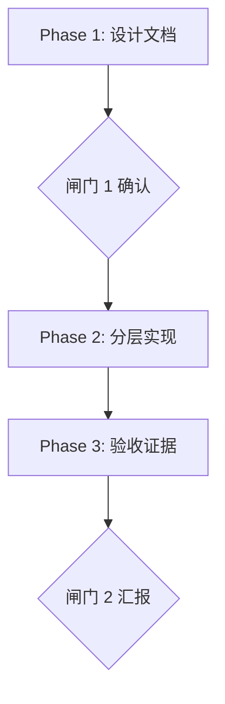

# 任务书：从零设计并实现 axum-starter-template

> 本文是任务书，不是设计文档——设计文档由你产出（`docs/architecture.md`），并必须在两处闸门停下等人确认。
>
> 仓库：`axum-starter-template`（远端 `https://github.com/RivTian/axum-starter-template.git`）

---

## 0. 一句话

在 `axum-starter-template` 仓库里**从零设计并实现**一份 `cargo-generate` 模板：生成出来的项目开箱就是一个可以进生产的 Rust Web 服务骨架，且骨架本身把一组难写对的进程纪律写对。

---

## 1. 仓库事实与「第一天」的契约

### 1.1 已核实事实（不必重新确认）

| 事实 | 内容 |
| --- | --- |
| `main` | 只有一个提交 `71b5540 chore: initialize repository`，**工作树为空**（无任何被跟踪文件） |
| 备份分支 | `backup/main-20260913-multi-rt-design`、`backup/main-20260915-multi-rt-design`、`origin/backup/main-20260916-template-redesign` |
| 基线 | **没有**。本次从零开始，上述分支不是可供增量修补的基线（用法见 §1.3） |

### 1.2 模板用户的「第一天」（可验收契约）

模板用户是从模板起一个新 Rust Web 服务的人，通常一个人，第一天就要交出一个能起、能停、能测的进程。流程必须恰好是这样：

1. **生成**：`cargo generate --git <本模板仓库> --name <project-name>`，回答一个提示 `crate_prefix`（包名前缀）。两个名字分开：
   - `project-name` 是项目名（仓库名、二进制名 `{{crate_name}}`、README 标题）；
   - `crate_prefix` 是包名前缀（`<prefix>-core` / `<prefix>-storage` …）；
   - 生成完成后，用户改 `[workspace.package]` 的 `version` / `authors`。
2. **验证骨架在自己机器上成立**：
   - `make check` 三条门禁全绿（`fmt-check` / `lint` / `test`）；
   - `cargo run` 起进程，第一条日志能看到构建串；
   - `Ctrl-C` 看关停日志里每个任务的 `stopped`（带任务名与所在 runtime）。
3. **加第一个顶层任务面**：按 README 的垂直切片，把自己写的一个任务注册进 supervisor（骨架不预置示例任务面）；加完 `Ctrl-C` 能看到它有 `stopped`。
4. **需要库表时**：走 README「怎么加一个仓储」——迁移、仓储实现、装配接线一条龙（骨架不预建表、不预放仓储；README 的这条步骤必须能照抄走通）。

占位符约定（文档举例用 `svc` 作前缀）：

| 占位符 | 来源 | 用途 |
| --- | --- | --- |
| `{{crate_prefix}}` | 生成时的唯一交互提示 | 包名前缀：`svc-core` / `svc-storage` / `svc-app` … |
| `{{crate_prefix_snake}}` | pre hook 派生 | Rust 路径形态 |
| `{{crate_name}}` | cargo-generate 内置（来自 `--name`） | 二进制名 / README 标题 |
| `{{env_prefix}}` | pre hook 派生自 `crate_name` 大写 | 环境变量前缀 |

**硬约束**：`project-name` 与 `crate_prefix` 是两个独立输入。模板不得假设它们相等，也不得用其中一个悄悄顶替另一个。是否给 `crate_prefix` 提供默认值，由设计裁决（见 DP8）。

### 1.3 备份分支的用法（红线）

- 不得 `checkout` 某个备份分支改，不得复制它的文件树，不得把它当成可增量修补的基线。
- 不得把备份分支里的结构、命名、结论作为设计依据；设计结论必须从本任务书与第一原理推导。
- 默认**不读**备份分支——§5 已把已知雷区内嵌，足够用。确需核对某条雷区的机制时，只读对照实现，只把「机制事实」写进设计文档，不得引用其取舍作为理由。

---

## 2. 目标：必须成立的不变量

> 以下五条是验收对象。每条都必须有**代码里的落点**与**自动化证据**；只有文档表述不算成立。

### I1 单向分层的 workspace，越界即红

- 多个 crate，依赖边是一张可机械校验的邻接表；邻接表之外的边一律非法，越界即红。
- 叶子稳定：`core` 不依赖任何兄弟 crate；新增一条边必须写理由并更新邻接表。
- 第三方依赖只在根 `[workspace.dependencies]` 声明一次，成员一律 `{ workspace = true }`；每条依赖旁一句「为什么」，没理由的依赖不该在表里。
- 窄门面：`lib.rs` / `mod.rs` 只做 `mod` 声明与显式 `pub use`，不做扁平化 re-export；每个例外出口写理由。
- **判据**：门禁里有一条能机械比对「实际依赖图 == 邻接表」，越界、漏登记都红。

### I2 顶层任务面可监督

- 顶层任务经 supervisor 注册；任务面**返回 future**，spawn 到哪个 runtime 由装配层决定，面内不写死 spawn。
- 退出原因必须区分五类：**正常返回 / 返回错误 / panic / 被外部取消 / 重启**（supervisor 主动重启导致的上一化身退出）。
- 每条退出记录携带：任务名 + 所在 runtime（其余字段形状由设计裁决）。
- 任一时刻同一 key 只有一个化身；不留 detached task；空 supervisor 正常退出。
- **判据**：「不留 detached」「同 key 不双化身」「五类退出各有可观测记录」都有自动化证据。

### I3 关停可预测、可解释

- 固定关停序列，写进文档注释并被测试钉住。一个可用的候选（要么采纳并给出理由，要么给出更好的并说明代价）：广播关停事件 → cancel → 限时收割顶层任务 → 存储最后关 → 退出 `block_on` → 附加 runtime 逆序同步关闭。
- 分层**绝对**预算：每一层有自己的绝对上限，内层 < 外层且留余量；第二次停止请求只**加速**，不刷新截止时间。
- 收不回来的任务如实上报（still running / aborted），不得假报 graceful；`stopped` 只给真正收尾的任务。
- **判据**：每段预算都有上限且有测试钉住；「超时未收割」与「第二次停止信号」各有一条测试。

### I4 三段式配置加载 + 热重载不骗人

- 三个入口：**CLI 指定、环境变量、根据路径锚点的相对路径**。
- 路径锚点 = 可执行文件所在目录，永远不取 cwd。CLI / 环境变量只能覆盖「配置文件的位置」，不能改路径锚点；配置里的相对路径（含数据目录）一律从同一锚点派生，不以「配置文件所在目录」为基准。
- 启动与热重载**共用同一条管线**：读文件（缺文件落盘内嵌模板）→ 环境变量 → 反序列化（带字段路径定位）→ 路径解析 → 补全 → 校验 → 钳位。两条管线迟早漂移。
- 校验只拦「继续跑必然失败」的取值；其余越界钳位 + warn。无人值守下拒绝启动的代价远大于按保守值跑。
- 每段 `#[serde(default, deny_unknown_fields)]`：拼错键即错误，缺段等价默认，零配置可起；内嵌模板取值与 `Default` 逐字段一致，有测试钉住。
- 热度分档（可热 / 半热 / 不可热）。不可热段 reload 时**回滚为运行值**并列入待重启清单——**watch 里的配置必须永远等于生效中的配置**。
- 重载失败保留 last-good，绝不半套用；漏登记冷段必须会红，不能静默假报已生效。
- 敏感信息取值优先级固定（`*_env > *_file > 明文`），`Debug` 手写渲染为 `***`。
- **判据**：冷段漏登记的判别方式不能是「按面登记」；必须给出漏登记时会红的机制。

### I5 生成契约本身成立

- 生成路径与命名见 §1.2，一字不改地成立；pre hook 负责派生与**校验** `crate_prefix` 的形状（cargo 必须原样接受 `svc-core` 这类包名）。
- 生成结果侧：`make check` = `fmt-check` + `lint` + `test` 三条，是门禁的**唯一定义**；不需要任何非 Rust 工具链就能跑。
- 生成结果的 README 必须承载两条垂直切片：**加第一个顶层任务面**、**怎么加一个仓储**；步骤要能照抄走通，且模板仓库有可重复证据证明走过通（不是只写文档）。
- 生成结果不带 CI 配置。
- 生成结果里搜不到模板内部材料、里程碑 / 阶段编号、未交付文档的引用。
- **判据**：至少一次真实换名生成走 cargo-generate 自己的展开路径（不复用编译缓存、生成目录在仓库树外），且覆盖一组极端长名与一组极短名。

### 支撑约束（不单列为目标，违反即不合格）

- **零业务全局态**：指标、事件总线、配置句柄、存储全部由装配层构造并注入，无业务 `static`；一个进程里能同时跑两套独立装配（生命周期、配置、数据库、取消互不干扰）。
- **可观测性只在装配层初始化**：库 crate 只 `use tracing` 发事件，永不装 subscriber；日志形态只出一种，不留格式开关；测试不装全局 subscriber；日志里不出现 secret。
- **取证纪律**：引用 cargo-generate / tokio / axum / 其他第三方语义时，写清版本号与出处（源码路径或官方文档锚点），不写行号。

---

## 3. 非目标（红线，不得越界）

- **不是框架。** 没有 `trait Service`、没有插件系统、没有宏。模板是一份纪律写在注释里的起点代码，复制之后改，不是依赖之后调。
- **不带业务。** 生成出来的服务无示例任务面和 API 端点。
- **不做预铺。** 不预建表、不预放 `AppState` 字段、不预抽 `middleware/` 目录、不带假成功实现。
- **不带任何具体部署事实。** 交叉编译目标、glibc 门禁、容器链、端口号都是项目事实，不是可复用纪律。
- **生成结果不带 CI 配置。**

**反例判定**（满足任一条即越界）：以「以后可能会用」为理由的文件 / 字段 / 依赖 / 配置项；把上述项目事实写死进模板；生成结果里出现模板仓库自己的门禁目标或材料。

---

## 4. 设计必须逐条回答的决策点（DP）

规则：每条给出 ≥2 方案 → 各自代价 → 你的选择 → 选择判据；**不允许合并、不允许跳过**。涉及架构 / 公共接口 / 数据结构的决策必须进「待拍板清单」，闸门 1 等确认，不得先斩后奏；纯实现细节可直接选定，但要在设计文档里写明原因。

| # | 决策点 | 必须回答的问题 |
| --- | --- | --- |
| DP1 | crate 集合与依赖邻接表 | 成员有哪些、每个 crate 骨架里放什么、哪些边合法、禁止哪些边；`storage` / `testkit` 这类成员的最薄成立形态是什么，与「不预建表、不做预铺」的张力怎么裁决；两条 README 垂直切片（加任务面 / 加仓储）各自需要多少骨架支撑，砍到哪一层仍能照抄走通 |
| DP2 | runtime 拓扑 | 单主 runtime，还是可选附加 runtime；I2 里「所在 runtime」怎么表达；解析一个未配置的名字是启动错误还是回落；多 runtime 的准入清单 |
| DP3 | supervisor 重启语义 | 重启策略与预算；什么退出会导致进程退出、什么退出只会触发重启；重启与「正常关停」的边界 |
| DP4 | panic 策略 | `abort` 还是 `unwind`；与 I2 的退出分类、可观测性是否自洽 |
| DP5 | 启动协议 | 「注册即运行」还是显式启动门（准备 ≠ 提交）；监听 / 注册与 Running 的边界；缺确认时的上限 |
| DP6 | 关停预算分层 | 各层绝对上限、余量关系；第二次停止信号语义；超时未收割如何上报 |
| DP7 | 配置真值与热度 | 三段入口的优先级；热度分档判据；冷段漏登记会红的机制；路径锚点与配置文件位置的边界 |
| DP8 | 渲染面与改名手法 | `crate_prefix` 成为提示占位符后，哪些文件过 Liquid、`.rs` 怎么办（rustfmt 名字无关性，见 §5）；`Cargo.lock` 是否随模板发布、门禁是否带 `--locked`；`crate_prefix` 与依赖图撞名怎么处理；`crate_prefix` 默认值给不给 |
| DP9 | API 面范围 | 零路由，还是仅系统端点（health / ready）；端口从哪来；就绪语义（若保留） |
| DP10 | 测试与门禁形态 | 测试布局；结构纪律做成 Rust 测试还是脚本；真实进程探针是否进门禁；模板侧门禁与生成结果侧门禁如何分工；模板仓库自己要不要 CI |

---

## 5. 已知雷区（通用事实）

以下机制在 cargo-generate 0.24.0 上被实测过。你必须在**你实际使用的版本**上复核，并把版本与出处写进 `docs/references.md`；实测与本节不符时以实测为准。

1. **渲染 ≠ 拷贝 ≠ 发布。** `include` / `exclude` 决定一个文件过不过 Liquid；不在渲染面里的文件是**逐字节拷贝**，不是被丢掉；决定「进不进生成结果」的是 `ignore`。三者别混。
2. **`ignore` 收字面路径，不存在的路径静默跳过。** 写错名字或顺手写成通配符不报错、不警告，只会静默泄漏。要有反向断言：证明「这些路径确实不在生成结果里」。
3. **hooks 顺序是 pre → 按 `ignore` 删文件 → 渲染 → post → 工具删除 hook 文件（不删目录）。** `hooks/` 不能写进 `ignore`，否则 post hook 会在轮到它之前被删掉；post 不需要自删，但要收走空目录。
4. **hook 里 `abort` 是廉价的**（渲染与钩子全在临时目录，最后才整体拷贝），但目标目录在跑钩子**之前**就建好了：abort 后重试必须先删掉那个空目录，否则下一句报错与真实原因无关。
5. **rustfmt 不是名字无关的。** 排版取决于替换**之后**的行宽与排序，「对某组名字 fmt-clean」不蕴含「对任意名字都成立」。要么让 `.rs` 与名字解耦（不过 Liquid），要么必须有「换名重跑 fmt」的门禁——二选一，显式写。
6. **Liquid 的 `{{` 与 Rust 的转义花括号冲突。** 凡 `.rs` 过 Liquid，含 `{{` 的文件必须进 `exclude`，且这个名单随文件增减维护；配置占位符因此不能用 `{{ }}` 定界。
7. **随模板发布 `Cargo.lock` + 门禁带 `--locked` 时**：若成员包名与依赖图里已有包同名（`axum-core` 这类），cargo 会改用「名字 + 版本」消歧形式，发布时的锁文件立刻失配，用户的第一条命令红在与真实原因无关的地方。要么在 pre hook 拒绝撞名前缀，要么不发布锁 / 不带 `--locked`。
8. **`panic = "abort"` 会绕过 supervisor 观察 task panic**，也绕过 HTTP 层的 panic 捕获；`unwind` 才能把 panic 变成可分类的退出原因。选择必须与 I2 自洽。
9. **Tokio 的几条硬语义**：`Runtime` 不能在 async 上下文里 drop；`shutdown_background` 不等任务收尾；`current_thread` 的附加 runtime 没人 `block_on`，spawn 进去的任务永不执行；IO 资源在创建它的 runtime 上注册——共享资源（池、总线）在主 runtime 建，主 runtime 最后关。
10. **环境变量门控的测试，「静默跳过」与「全绿」长得一样。** 声明了却连不上的外部依赖必须**红而不跳**；CI / 脚本里导出的前缀要与源码常量对字面量。
11. **cargo-generate 不看模板自己的 `.gitignore`。** 本机残留（`.DS_Store`、`target/`）会原样进每一个生成结果；`ignore` 只管得住仓库根的字面路径，子目录要靠门禁递归扫。
12. **生成结果里不得出现里程碑词、阶段编号、未交付文档的引用。** 注释就地解释当前的不变量、约束与失败边界；审计要在生成阶段做，不要等完整 `check` 才发现残留。

---

## 6. 设计文档要求（`docs/architecture.md`）

### 6.1 必须覆盖的章节

```text
 1. 目标 / 非目标 / 「第一天」的可验收契约
 2. 纪律清单        每条：纪律 → 为什么 → 代码里的落点（文件级）→ 自动化证据
 3. workspace 划分  依赖邻接表、禁止的边、每个 crate 的骨架内容
 4. runtime 与任务面  拓扑、五类退出、任务名与 runtime 身份
 5. 进程生命周期     启动协议、关停序列、分层绝对预算、诚实上报
 6. 配置与热重载     三段入口、路径锚点、热度分档、重载事务、漏登记会红的机制
 7. HTTP 面（若有）  范围、端口来源、就绪语义
 8. 存储面（若有）   门面形状、编译闭包、关闭所有者、迁移纪律
 9. 生成面           占位符与派生变量、渲染白名单、hooks 职责、改名、两侧门禁分工
10. 测试策略         不变量 → 证据形态 → 已知限制
11. 决策记录         DP1–DP10 逐条
12. 待拍板清单       格式见 §11 的表格
13. 证据索引         本地代码证据 + 第三方语义依据（带版本）
```

### 6.2 写作纪律

- 先摆事实再给方案；每条决策带理由；**每个「不选另一种」都要写清那一种的代价**。
- 辅助图：适合图的主题（依赖邻接、runtime / 任务拓扑、关停序列、配置管线、生命周期状态机）用 Mermaid；Mermaid 不适合才用 ASCII。示例：



- 禁止写「细节没处理好」「已优化」「更健壮」这类没有落点的结论。

---

## 7. 工作流程与闸门

### 阶段 0 — 设计与裁决

- 产出 `docs/architecture.md`（§6）与 `docs/references.md`（第三方语义的版本与出处）。
- 产出「待拍板清单」：所有架构 / 公共接口 / 数据结构级决策，按 §9 的表格格式列出。
- 🚧 **闸门 1：停下等人确认。** 不要自行开工实现。

### 阶段 1 — 实现（按层推进）

- 顺序建议：`core` → 其余成员 → 装配层 → 工程链（cargo-generate / hooks / 两份 Makefile / 模板门禁）→ README。
- **每一层落地后门禁必须全绿再进下一层**，不攒到最后。
- 每层同步写 crate 级 README：边界 / 目录 / 关键决策 / 测试形态。
- 提交粒度按层切，commit message 说明这一层承担了哪几条不变量。

### 阶段 2 — 验收与验证

- 产出 `docs/acceptance.md`：§2 的每条不变量 → **可重复证据**（仓库相对路径 + 测试名或场景名）→ 结论与限制。**不用测试总数替代逐项对应**；没有证据的条目显式标「无自动化证据」，不要留白。
- 产出 `docs/verification.md`：实际跑过的门禁、真实环境（OS / Rust / 工具版本）、结果。**没跑过的不写成跑过；本地绿不等于远端或其他平台通过。**
- 🚧 **闸门 2：交付前汇报。**

---

## 8. 交付物清单

```text
docs/architecture.md        设计文档（阶段 0，闸门 1）
docs/references.md          第三方语义依据（版本 + 出处）
docs/acceptance.md          不变量 → 证据索引（阶段 2）
docs/verification.md        本次验证记录（阶段 2）

（模板侧）
Cargo.toml                  workspace 根：成员、profile、依赖表（每条带理由）
<各 crate>/                 src + README.md + 测试
cargo-generate.toml         渲染白名单 / ignore / hooks 声明 / 版本兼容区间
hooks/pre.rhai              派生变量与身份校验
hooks/post.rhai             改名、边界断言、收尾
模板侧 Makefile              模板仓库自己的门禁（展开 + 生成结果校验）
README.md                   怎么用与怎么维护这个模板

（生成结果侧）
Makefile                    三条门禁：fmt-check / lint / test
README.md                   生成结果拿到的 README（含「加第一个顶层任务面」「怎么加一个仓储」两条垂直切片）
<各 crate>/README.md        每层边界与关键决策
```

> 模板侧与生成结果侧的 Makefile / README 不能同名，需要一个改名步骤；模板侧用什么名、改名放在哪一步，由 DP8 / DP10 裁决。

---

## 9. 完成定义（DoD）

1. 模板仓库自己的门禁全绿，且覆盖：依赖邻接表校验、渲染面与泄漏审计、生成结果的 `make check`。
2. 至少一次真实换名生成：走 cargo-generate 自己的展开路径、不复用编译缓存、生成目录在仓库树外；覆盖一组极端长名与一组极短名。
3. 生成结果在干净目录里：`make check` 三条全绿；`cargo run` 起进程且第一条日志有构建串；`Ctrl-C` 后关停日志里每个任务都有 `stopped`（任务名 + runtime）；退出码正确。
4. 「第一天」的四步都成立：README 的两条垂直切片（加第一个顶层任务面、怎么加一个仓储）各被实际走通一次并记入 `docs/verification.md`。
5. 生成结果里搜不到：模板内部材料、里程碑 / 阶段编号、未交付文档引用、模板仓库自己的门禁目标。
6. `docs/acceptance.md` 每条不变量都有可重复证据或显式的「无自动化证据」，没有留白。
7. 每条新增第三方依赖旁有一句「为什么」。
8. 零配置可起：不写配置文件也能启动；路径锚点正确；「换个目录启动读到另一份配置」这类故障被结构性排除。
9. 关停每段预算都有绝对上限且有测试钉住；收不回来的任务上报为未收割。

---

## 10. 硬性禁止

- ❌ `checkout` 某个备份分支改，或把它的文件树 / 设计文档改几段交付。
- ❌ 写「细节没处理好」「已优化」「更健壮」这类没有落点的结论。
- ❌ 声称跑过没跑过的门禁；声称验证过没验证过的平台。
- ❌ 预铺猜形状的东西：预建表、没有消费者的状态字段、只有一个文件的 `middleware/` 目录、假成功实现。
- ❌ 在库 crate 里初始化 tracing、建常驻任务，或让公共 API 出现驱动类型。
- ❌ 为「显得完整」而加依赖、加 feature、加配置项。
- ❌ 跳过闸门 1 直接开始实现。
- ❌ 子 agent：默认不开。只允许大范围只读检索、真正独立的多路任务、一次性长文本消化三种场景，且不得递归派生。

---

## 11. 汇报格式与决策处理

- 每个阶段结束时给一段**结论优先**的汇报：这一阶段定了什么、有什么没定、下一步做什么。
- 涉及文件时给 `路径:行号` 形式的引用，不贴大段原文。
- 遇到与本任务书冲突的事实（例如某条不变量在新方案下不成立），**先说出来再继续**，不要默默绕过。
- 闸门处必须停下等人确认，不要自答自批。
- 发现设计与当前代码冲突，或需要决策时，单独列出下表；`冲突位置` 填文件 / 章节落点，纯新增决策填「新增决策」：

| 冲突位置 | 冲突说明 | 方案 A | 方案 B | 推荐方案 | 是否需要我确认 |
| --- | --- | --- | --- | --- | --- |
| 示例：`docs/architecture.md §4` | 退出分类是否含重启 | 单 runtime，不实现重启 | 支持重启并单列第五类退出 | 方案 B | 是 |

- **规则**：涉及架构调整、公共接口变化、数据结构变化时，必须等待确认；只是实现细节时，可以推荐最合理方案，但需要在计划中说明原因。
